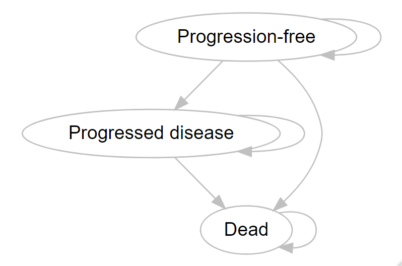
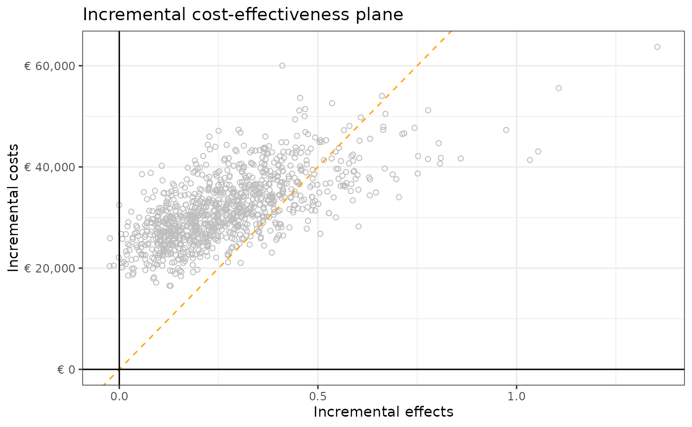
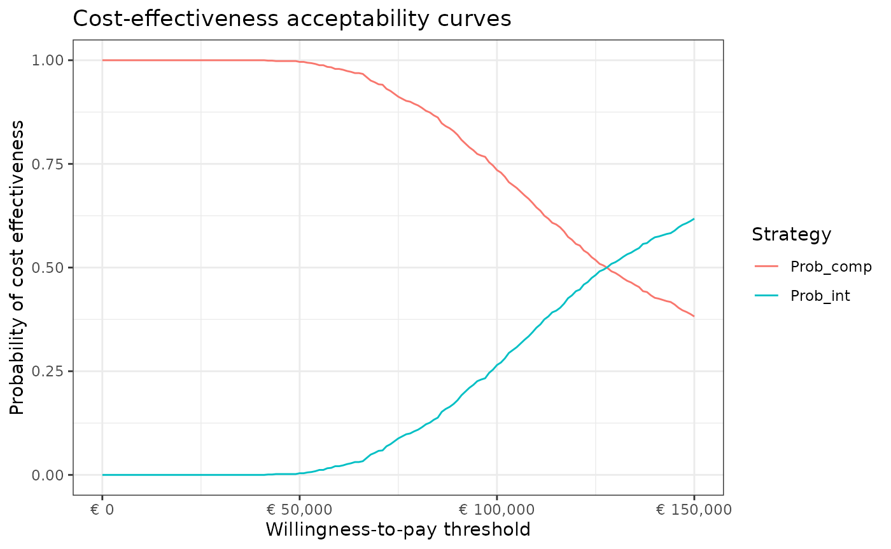
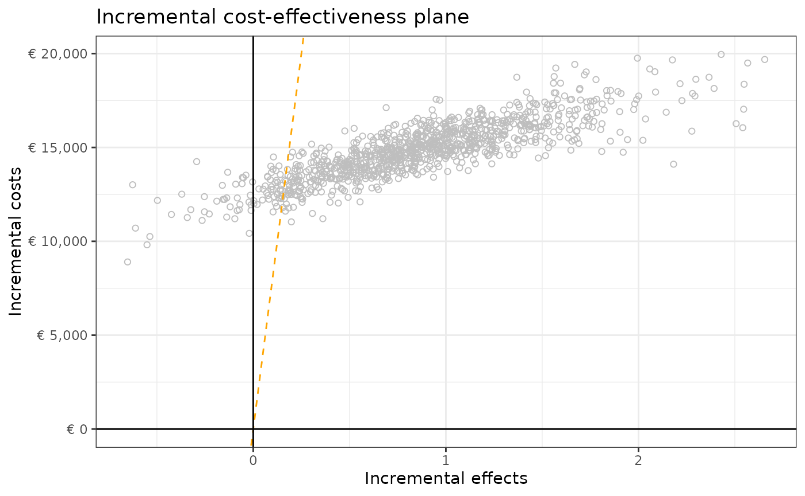
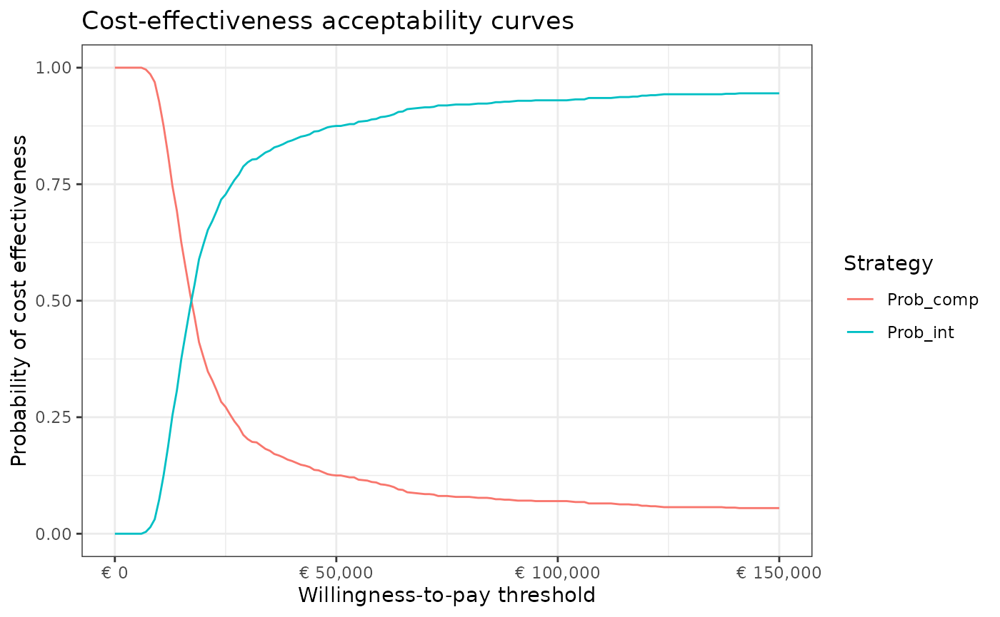

# Health Economic Model Description

## Description

This Appendix describes the probabilistic model inputs and outputs of
the mock health economic (HE) models developed to tests the
functionalities of the Probabilistic Analysis Check dashBOARD
(PACBOARD). The HE models and functions are available at
<https://github.com/Xa4P/pacheck>. The input and output values are
stored within the `df_pa` and `df_pa_psm` objects of the `pacheck`
package. The `df_pa` and `df_pa_psm` objects were obtained by running
the `01-data_preparation.R` R script. The `df_pa` object contains the
probabilistic inputs and outputs obtained with a health state transition
model (HSTM) and the `df_pa_psm` object contains the probabilistic
inputs and outputs obtained with a partitioned survival model (PSM).

## Model description

Both HE models compare two strategies, called “intervention” and
“comparator” for the treatment of metastatic breast cancer. We used a
yearly cycle and a time horizon of 30 years. We did not apply half cycle
correction.  
The “intervention” strategy incurs treatment costs and reduces the
transition probability from “progression free” (PF) to “progressed
disease” (PD) compared to the “comparator” strategy in the HSTM and it
reduces the probability of progression and death in the PSM. In
addition, there is a chance of experiencing adverse events in the
intervention strategy which incurs additional costs and utility
decrement once at the beginning of both HE models. The “comparator”
strategy entails “doing nothing” and does not incur any treatment costs
and adverse event-related utility decrement or costs.

### Model structure & assumptions

A cohort-based HSTM and PSM with three health states were developed. The
health states were: PF, D, and “Dead” (D). All individuals of the cohort
start in the PF health state and can progress to the PD health state or
to the D health state. Once individuals are in the PD health state, they
cannot transit back to the PF health state but they can transit to the D
health state. The D health state is the absorbing health state. The
model structure is provided below.

## Model inputs

The probabilistic model inputs were estimated based on the
below-described distribution and parameter estimates, using the
[`generate_pa_inputs()`](https://xa4p.github.io/pacheck/reference/generate_pa_inputs.md)
and
[`generate_pa_inputs_psm()`](https://xa4p.github.io/pacheck/reference/generate_pa_inputs_psm.md)
functions of the `pacheck` package.

| Parameter name | Description                                                                       | Mean value | Standard Error (or 95%CI) | Distribution |
|:---------------|:----------------------------------------------------------------------------------|:-----------|:--------------------------|:-------------|
| `p_pfspd`      | Probability of transiting from PF to PD                                           | 0.15       | 0.04\*                    | Dirichlet    |
| `p_pfsd`       | Probability of transiting from PF to D                                            | 0.1        | 0.03\*                    | Dirichlet    |
| `p_pdd`        | Probability of transiting from PD to D                                            | 0.2        | 0.04                      | Beta         |
| `p_ae`         | Probability of experiencing an adverse event (intervention only)                  | 0.05       | 0.02                      | Beta         |
| `rr`           | Relative risk of progression (PF to PD) of the intervention versus the comparator | 0.75       | 0.62-0.88                 | Lognormal    |
| `u_pfs`        | Utility value of health state PF                                                  | 0.75       | 0.07                      | Beta         |
| `u_pd`         | Utility value of health state PD                                                  | 0.55       | 0.1                       | Beta         |
| `u_ae`         | Utility decrement when experiencing an adverse event                              | 0.15       | 0.05                      | Beta         |
| `c_pfs`        | Annual costs of health state PF                                                   | 1000       | 200                       | Normal       |
| `c_pd`         | Annual costs of health state PD                                                   | 2000       | 400                       | Normal       |
| `c_thx`        | Annual costs treatment (intervention)                                             | 10000      | 100                       | Normal       |
| `c_ae`         | Costs of treating an adverse event                                                | 500        | 100                       | Gamma        |
| `r_d_effects`  | Annual discount rate effects                                                      | 0.015      | \-                        | Fixed        |
| `r_d_costs`    | Annual discount rate costs                                                        | 0.04       | \-                        | Fixed        |

Overview of the HSTM input values

\*Calculated based on the output of the Dirichlet distribution

| Parameter name       | Description                                                                                                     | Mean value | Standard Error (or 95%CI) | Distribution                                     |
|:---------------------|:----------------------------------------------------------------------------------------------------------------|:-----------|:--------------------------|:-------------------------------------------------|
| `r_exp_pfs_comp`     | Rate exponential progression-free survival curve of the comparator strategy                                     | 0.79\*     | 0.03\*                    | Bootstrap synthetic data                         |
| `rr_thx_pfs`         | Effectiveness of the intervention on the rate of progression of the comparator                                  | 0.52\*     | 0.02\*                    | Bootstrap synthetic data                         |
| `r_exp_pfs_int`      | Rate exponential progression-free survival curve of the intervention strategy                                   | 0.52\*     | 0.02\*                    | Calculation: `r_exp_pfs_comp` \* `rr_thx_pfs`    |
| `shape_weib_os`      | Shape of the Weibull overall survival curve (same shape for both strategies)                                    | 1.88\*     | 0.17\*                    | Bootstrap synthetic data                         |
| `scale_weib_os_comp` | Scale of the Weibull overall survival curve of the comparator strategy                                          | 13\*       | 1.41\*                    | Bootstrap synthetic data                         |
| `rr_thx_os`          | Effectiveness of the intervention on the scale of the Weibull overall survival curve of the comparator strategy | 1.16\*     | 0.11\*                    | Bootstrap synthetic data                         |
| `scale_weib_os_int`  | Scale of the Weibull overall survival curve of the intervention strategy                                        | 15.06\*    | 1.84\*                    | Calculation: `scale_weib_os_comp` \* `rr_thx_os` |
| `p_ae`               | Probability of experiencing an adverse event (intervention only)                                                | 0.05       | 0.02                      | Beta                                             |
| `u_pfs`              | Utility value of health state PF                                                                                | 0.75       | 0.07                      | Beta                                             |
| `u_pd`               | Utility value of health state PD                                                                                | 0.55       | 0.1                       | Beta                                             |
| `u_ae`               | Utility decrement when experiencing an adverse event                                                            | 0.15       | 0.05                      | Beta                                             |
| `c_pfs`              | Annual costs of health state PF                                                                                 | 1000       | 200                       | Normal                                           |
| `c_pd`               | Annual costs of health state PD                                                                                 | 2000       | 400                       | Normal                                           |
| `c_thx`              | Annual costs treatment (intervention)                                                                           | 10000      | 100                       | Normal                                           |
| `c_ae`               | Costs of treating an adverse event                                                                              | 500        | 100                       | Gamma                                            |
| `r_d_effects`        | Annual discount rate effects                                                                                    | 0.015      | \-                        | Fixed                                            |
| `r_d_costs`          | Annual discount rate costs                                                                                      | 0.04       | \-                        | Fixed                                            |

Overview of the PSM input values

\*Calculated based on the output of the bootstrapping

## Analysis

A probabilistic analysis of 10,000 iterations was performed through
Monte Carlo analysis using both HE models. Model inputs and intermediate
and final output values for each iteration were recorded. The recorded
outputs were:  
- `t_ly_int` & `t_ly_comp`: total undiscounted life years for each
strategy  
- `t_ly_d_int` & `t_ly_d_comp`: total discounted life years for each
strategy  
- `t_qaly_int` & `t_qaly_comp`: total undiscounted quality-adjusted life
years for each strategy  
- `t_qaly_d_int` & `t_qaly_d_comp`: total discounted quality-adjusted
life years for each strategy  
- `t_costs_int` & `t_costs_comp`: total undiscounted costs for each
strategy  
- `t_costs_d_int` & `t_costs_d_comp`: total discounted costs for each
strategy  
- `t_ly_pfs_d_int`, `t_ly_pd_d_int`, `t_ly_pfs_d_comp` &
`t_ly_pd_d_comp`: discounted life years per health state for each
strategy  
- `t_qaly_pfs_d_int`, `t_qaly_pd_d_int`, `t_qaly_pfs_d_comp` &
`t_qaly_pd_d_comp`: discounted quality-adjusted life years per health
state for each strategy  
- `t_costs_pfs_d_int`, `t_costs_pd_d_int`, `t_costs_pfs_d_comp` &
`t_costs_pd_d_comp`: discounted costs per health state for each
strategy  
- `t_qaly_ae_int`: total quality-adjusted life years decrement
associated with the occurrence of adverse events  
- `t_costs_ae_int`: total costs associated with the occurrence of
adverse events  
- `inc_ly`: incremental discounted life years of the intervention versus
the comparator  
- `inc_qaly`: incremental discounted quality-adjusted life years of the
intervention versus the comparator  
- `inc_costs`: incremental discounted costs of the intervention versus
the comparator  
The probabilistic analysis is performed using a for loop and the
function
[`perform_simulation()`](https://xa4p.github.io/pacheck/reference/perform_simulation.md).

## Results HSTM

The intervention results in 0.29 incremental life years, 0.27
incremental quality-adjusted life years, and € 31,753 incremental costs
versus the comparator. The incremental cost effectiveness ratio of the
intervention versus the comparator is € 117,318 per QALY.  
The probabilistic results of this HE model are provided in the table
below and are plotted in an incremental cost-effectiveness plane
(displaying a willingness to pay threshold line of €80,000 per QALY) and
a cost-effectiveness acceptability curve.

| Strategy     | Total LYs | Total QALYs | Total costs | Inc. QALYs | Inc. costs | ICER per QALYs |
|:-------------|:----------|:------------|:------------|:-----------|:-----------|:---------------|
| Comparator   | 5.69      | 3.73        | € 7,215     | \-         | \-         | \-             |
| Intervention | 5.98      | 4           | € 38,968    | 0.27       | € 31,753   | € 117,318      |

Overview of the results of the HE model

Abbreviations: ICER = incremental cost-effectiveness ratio; Inc. =
incremental; LYs = life years; QALYs = quality-adjusted life years

## Results PSM

The intervention results in 1.36 incremental life years, 0.87
incremental quality-adjusted life years, and € 14,865 incremental costs
versus the comparator. The incremental cost effectiveness ratio of the
intervention versus the comparator is € 17,140 per QALY.  
The probabilistic results of this HE model are provided in the table
below and are plotted in an incremental cost-effectiveness plane
(displaying a willingness to pay threshold line of €80,000 per QALY) and
a cost-effectiveness acceptability curve.

| Strategy     | Total LYs | Total QALYs | Total costs | Inc. QALYs | Inc. costs | ICER per QALYs |
|:-------------|:----------|:------------|:------------|:-----------|:-----------|:---------------|
| Comparator   | 9.81      | 5.53        | € 15,819    | \-         | \-         | \-             |
| Intervention | 11.17     | 6.4         | € 30,684    | 0.87       | € 14,865   | € 17,140       |

Overview of the results of the HE model

Abbreviations: ICER = incremental cost-effectiveness ratio; Inc. =
incremental; LYs = life years; QALYs = quality-adjusted life years

