# Example workflow using the \`pacheck\` R package

## Introduction

This article describes an example workflow for the use of the `pacheck`
package.  
This vignette is still in development.

### 1. Upload of original health economic model inputs and outputs

``` r
df_pa <- calculate_nb(df = df_pa,
                      e_int = "t_qaly_d_int",
                      e_comp = "t_qaly_d_comp",
                      c_int = "t_costs_d_int",
                      c_comp = "t_costs_d_comp",
                      wtp = 80000)# calculate net benefits
```

### 2. Investigate model inputs and outputs

#### a. Summary statistics of (user-selected) model inputs and outputs

*To examine whether cost inputs are always positive for instance*

``` r
df <- generate_sum_stats(df_pa)
kable(df)
```

| Parameter          |       Mean |        SD | Percentile_2.5th | Percentile_97.5th |    Minimum |    Maximum |     Median | Skewness | Kurtosis |
|:-------------------|-----------:|----------:|-----------------:|------------------:|-----------:|-----------:|-----------:|---------:|---------:|
| p_pfspd            |      0.150 |     0.036 |            0.086 |             0.227 |      0.056 |      0.273 |      0.150 |    0.288 |    2.992 |
| p_pfsd             |      0.099 |     0.029 |            0.049 |             0.162 |      0.023 |      0.210 |      0.098 |    0.418 |    3.158 |
| p_pdd              |      0.201 |     0.041 |            0.132 |             0.287 |      0.081 |      0.337 |      0.198 |    0.387 |    3.136 |
| p_dd               |      1.000 |     0.000 |            1.000 |             1.000 |      1.000 |      1.000 |      1.000 |      NaN |      NaN |
| p_ae               |      0.049 |     0.021 |            0.016 |             0.095 |      0.008 |      0.133 |      0.046 |    0.688 |    3.376 |
| rr                 |      0.752 |     0.066 |            0.635 |             0.891 |      0.571 |      0.992 |      0.747 |    0.376 |    3.165 |
| u_pfs              |      0.749 |     0.073 |            0.595 |             0.869 |      0.489 |      0.931 |      0.757 |   -0.496 |    3.116 |
| u_pd               |      0.553 |     0.101 |            0.351 |             0.739 |      0.259 |      0.830 |      0.552 |   -0.085 |    2.686 |
| u_d                |      0.000 |     0.000 |            0.000 |             0.000 |      0.000 |      0.000 |      0.000 |      NaN |      NaN |
| u_ae               |      0.151 |     0.049 |            0.067 |             0.263 |      0.037 |      0.345 |      0.148 |    0.523 |    3.403 |
| c_pfs              |    999.671 |   193.330 |          646.577 |          1376.131 |    308.816 |   1654.198 |    989.462 |    0.102 |    3.087 |
| c_pd               |   1980.918 |   402.919 |         1177.242 |          2756.374 |    636.935 |   3202.211 |   1983.282 |   -0.036 |    2.958 |
| c_d                |      0.000 |     0.000 |            0.000 |             0.000 |      0.000 |      0.000 |      0.000 |      NaN |      NaN |
| c_thx              |   9999.558 |    99.054 |         9796.212 |         10186.641 |   9681.366 |  10336.827 |   9999.813 |   -0.103 |    3.075 |
| c_ae               |    499.438 |   100.076 |          328.281 |           714.982 |    232.890 |    891.136 |    490.926 |    0.512 |    3.481 |
| t_qaly_comp        |      4.061 |     0.831 |            2.619 |             5.862 |      1.857 |      8.361 |      3.974 |    0.673 |    4.251 |
| t_qaly_int         |      4.378 |     0.929 |            2.760 |             6.408 |      1.999 |      8.912 |      4.294 |    0.712 |    4.249 |
| t_qaly_d_comp      |      3.725 |     0.724 |            2.432 |             5.266 |      1.766 |      7.250 |      3.654 |    0.597 |    4.001 |
| t_qaly_d_int       |      3.996 |     0.804 |            2.586 |             5.725 |      1.896 |      7.803 |      3.928 |    0.638 |    4.023 |
| t_costs_comp       |   9269.642 |  2293.187 |         5508.489 |         14873.693 |   4094.242 |  20263.209 |   9022.779 |    0.819 |    4.250 |
| t_costs_int        |  47424.555 | 10328.280 |        31014.615 |         69801.812 |  22968.730 |  99013.512 |  45792.275 |    0.780 |    4.150 |
| t_costs_d_comp     |   7214.577 |  1597.187 |         4474.254 |         11063.979 |   3322.865 |  13865.602 |   7067.409 |    0.635 |    3.720 |
| t_costs_d_int      |  38967.560 |  7362.606 |        26799.181 |         54462.057 |  20500.682 |  72567.952 |  38003.745 |    0.603 |    3.662 |
| t_ly_comp          |      6.228 |     1.089 |            4.421 |             8.666 |      3.237 |     11.836 |      6.124 |    0.646 |    3.907 |
| t_ly_int           |      6.576 |     1.211 |            4.565 |             9.283 |      3.406 |     12.160 |      6.469 |    0.630 |    3.780 |
| t_ly_d_comp        |      5.689 |     0.930 |            4.120 |             7.756 |      3.071 |     10.247 |      5.618 |    0.571 |    3.704 |
| t_ly_d_int         |      5.978 |     1.029 |            4.234 |             8.225 |      3.222 |     10.502 |      5.912 |    0.557 |    3.607 |
| t_ly_pfs_d_comp    |      2.938 |     0.666 |            1.887 |             4.425 |      1.387 |      6.334 |      2.878 |    0.735 |    3.928 |
| t_ly_pfs_d_int     |      3.547 |     0.809 |            2.231 |             5.321 |      1.727 |      7.549 |      3.446 |    0.731 |    3.969 |
| t_ly_pd_d_comp     |      2.751 |     0.714 |            1.595 |             4.324 |      1.040 |      6.696 |      2.697 |    0.702 |    4.198 |
| t_ly_pd_d_int      |      2.431 |     0.680 |            1.336 |             3.930 |      0.884 |      5.877 |      2.385 |    0.719 |    4.005 |
| t_qaly_pfs_d_comp  |      2.203 |     0.556 |            1.348 |             3.497 |      0.948 |      4.879 |      2.141 |    0.845 |    4.173 |
| t_qaly_pfs_d_int   |      2.658 |     0.670 |            1.586 |             4.215 |      1.180 |      6.195 |      2.576 |    0.859 |    4.355 |
| t_qaly_pd_d_comp   |      1.523 |     0.490 |            0.729 |             2.576 |      0.435 |      4.629 |      1.476 |    0.732 |    4.530 |
| t_qaly_pd_d_int    |      1.345 |     0.453 |            0.615 |             2.279 |      0.423 |      4.062 |      1.295 |    0.718 |    4.221 |
| t_costs_pfs_d_comp |   2675.011 |   799.195 |         1406.942 |          4432.220 |    793.888 |   7716.981 |   2565.168 |    0.939 |    5.339 |
| t_costs_pfs_d_int  |  34981.137 |  7374.794 |        22686.784 |         51299.957 |  18308.102 |  68863.988 |  34109.811 |    0.629 |    3.693 |
| t_costs_pd_d_comp  |   4539.566 |  1464.766 |         2124.354 |          8043.181 |   1421.473 |  10225.953 |   4378.848 |    0.779 |    3.935 |
| t_costs_pd_d_int   |   3962.182 |  1349.686 |         1794.809 |          7180.067 |   1144.180 |   9083.731 |   3762.961 |    0.859 |    4.052 |
| t_qaly_ae_int      |      0.007 |     0.004 |            0.002 |             0.018 |      0.001 |      0.027 |      0.007 |    1.265 |    5.064 |
| t_costs_ae_int     |     24.241 |    11.675 |            7.409 |            52.988 |      3.978 |     84.415 |     21.913 |    1.053 |    4.502 |
| inc_ly             |      0.289 |     0.195 |            0.004 |             0.741 |     -0.088 |      1.518 |      0.267 |    1.206 |    6.215 |
| inc_qaly           |      0.271 |     0.162 |            0.034 |             0.632 |     -0.024 |      1.354 |      0.247 |    1.315 |    6.849 |
| inc_costs          |  31752.983 |  6723.465 |        20573.126 |         46486.595 |  16508.440 |  63729.724 |  31027.028 |    0.624 |    3.671 |
| NMB_int            | 280706.492 | 58624.126 |       178890.052 |        401706.647 | 131147.731 | 551706.933 | 275644.049 |    0.620 |    3.993 |
| NMB_comp           | 290806.818 | 57064.404 |       188915.430 |        412008.941 | 137320.155 | 567089.638 | 285085.381 |    0.597 |    3.996 |
| iNMB               | -10100.326 |  9779.795 |       -25319.808 |         11751.086 | -33987.932 |  44628.255 | -11075.367 |    1.125 |    6.140 |
| NHB_int            |      3.509 |     0.733 |            2.236 |             5.021 |      1.639 |      6.896 |      3.446 |    0.620 |    3.993 |
| NHB_comp           |      3.635 |     0.713 |            2.361 |             5.150 |      1.717 |      7.089 |      3.564 |    0.597 |    3.996 |
| iNHB               |     -0.126 |     0.122 |           -0.316 |             0.147 |     -0.425 |      0.558 |     -0.138 |    1.125 |    6.140 |

``` r
rm(df)
```

#### b. Correlation matrix inputs (and outputs)

``` r
generate_cor(df_pa)
```

    ## Warning in cor(df): the standard deviation is zero

    ##                    p_pfspd p_pfsd  p_pdd p_dd   p_ae     rr  u_pfs   u_pd u_d
    ## p_pfspd              1.000 -0.131 -0.073   NA  0.011  0.027 -0.031  0.000  NA
    ## p_pfsd              -0.131  1.000  0.010   NA  0.015  0.058  0.020 -0.012  NA
    ## p_pdd               -0.073  0.010  1.000   NA -0.017 -0.014 -0.080 -0.044  NA
    ## p_dd                    NA     NA     NA    1     NA     NA     NA     NA  NA
    ## p_ae                 0.011  0.015 -0.017   NA  1.000  0.045 -0.011 -0.010  NA
    ## rr                   0.027  0.058 -0.014   NA  0.045  1.000  0.044 -0.053  NA
    ## u_pfs               -0.031  0.020 -0.080   NA -0.011  0.044  1.000  0.052  NA
    ## u_pd                 0.000 -0.012 -0.044   NA -0.010 -0.053  0.052  1.000  NA
    ## u_d                     NA     NA     NA   NA     NA     NA     NA     NA   1
    ## u_ae                -0.003 -0.062  0.013   NA -0.010 -0.042  0.016  0.060  NA
    ## c_pfs               -0.015 -0.050 -0.026   NA -0.032  0.000  0.029  0.044  NA
    ## c_pd                -0.001  0.017  0.021   NA  0.007 -0.015  0.003 -0.007  NA
    ## c_d                     NA     NA     NA   NA     NA     NA     NA     NA  NA
    ## c_thx               -0.025  0.045  0.003   NA -0.036  0.021 -0.033 -0.014  NA
    ## c_ae                -0.003  0.005  0.013   NA -0.021 -0.010 -0.022  0.083  NA
    ## t_qaly_comp         -0.235 -0.640 -0.431   NA -0.017 -0.057  0.333  0.406  NA
    ## t_qaly_int          -0.217 -0.714 -0.347   NA -0.027 -0.164  0.341  0.330  NA
    ## t_qaly_d_comp       -0.233 -0.644 -0.414   NA -0.018 -0.056  0.352  0.413  NA
    ## t_qaly_d_int        -0.213 -0.715 -0.334   NA -0.028 -0.161  0.362  0.336  NA
    ## t_costs_comp         0.096 -0.535 -0.541   NA -0.018 -0.023  0.042  0.029  NA
    ## t_costs_int         -0.515 -0.704 -0.068   NA -0.032 -0.269  0.014  0.019  NA
    ## t_costs_d_comp       0.136 -0.538 -0.487   NA -0.019 -0.021  0.035  0.031  NA
    ## t_costs_d_int       -0.519 -0.710 -0.052   NA -0.032 -0.271  0.011  0.020  NA
    ## t_ly_comp           -0.136 -0.749 -0.554   NA -0.010 -0.046  0.047  0.022  NA
    ## t_ly_int            -0.123 -0.820 -0.441   NA -0.015 -0.140  0.031  0.019  NA
    ## t_ly_d_comp         -0.130 -0.767 -0.538   NA -0.010 -0.047  0.044  0.022  NA
    ## t_ly_d_int          -0.114 -0.834 -0.427   NA -0.015 -0.138  0.029  0.020  NA
    ## t_ly_pfs_d_comp     -0.722 -0.553  0.052   NA -0.022 -0.066  0.025  0.006  NA
    ## t_ly_pfs_d_int      -0.605 -0.641  0.045   NA -0.030 -0.297  0.008  0.014  NA
    ## t_ly_pd_d_comp       0.505 -0.483 -0.749   NA  0.008  0.000  0.034  0.024  NA
    ## t_ly_pd_d_int        0.546 -0.500 -0.700   NA  0.013  0.144  0.034  0.014  NA
    ## t_qaly_pfs_d_comp   -0.665 -0.494  0.008   NA -0.025 -0.044  0.414  0.028  NA
    ## t_qaly_pfs_d_int    -0.564 -0.576  0.003   NA -0.033 -0.252  0.400  0.036  NA
    ## t_qaly_pd_d_comp     0.411 -0.391 -0.621   NA  0.002 -0.033  0.051  0.579  NA
    ## t_qaly_pd_d_int      0.457 -0.418 -0.597   NA  0.007  0.087  0.051  0.545  NA
    ## t_costs_pfs_d_comp  -0.522 -0.427  0.015   NA -0.049 -0.046  0.040  0.037  NA
    ## t_costs_pfs_d_int   -0.605 -0.641  0.043   NA -0.035 -0.295  0.008  0.019  NA
    ## t_costs_pd_d_comp    0.433 -0.353 -0.539   NA  0.006  0.002  0.016  0.014  NA
    ## t_costs_pd_d_int     0.474 -0.371 -0.517   NA  0.009  0.132  0.016  0.007  NA
    ## t_qaly_ae_int        0.006 -0.022 -0.006   NA  0.784  0.025 -0.010  0.019  NA
    ## t_costs_ae_int       0.007  0.019 -0.014   NA  0.889  0.034 -0.017  0.021  NA
    ## inc_ly               0.016 -0.744  0.311   NA -0.032 -0.505 -0.057 -0.003  NA
    ## inc_qaly            -0.014 -0.673  0.196   NA -0.059 -0.550  0.222 -0.180  NA
    ## inc_costs           -0.601 -0.650  0.059   NA -0.031 -0.292  0.004  0.014  NA
    ## NMB_int             -0.168 -0.695 -0.360   NA -0.026 -0.143  0.396  0.367  NA
    ## NMB_comp            -0.240 -0.639 -0.407   NA -0.017 -0.057  0.357  0.419  NA
    ## iNMB                 0.394 -0.442  0.218   NA -0.056 -0.527  0.290 -0.248  NA
    ## NHB_int             -0.168 -0.695 -0.360   NA -0.026 -0.143  0.396  0.367  NA
    ## NHB_comp            -0.240 -0.639 -0.407   NA -0.017 -0.057  0.357  0.419  NA
    ## iNHB                 0.394 -0.442  0.218   NA -0.056 -0.527  0.290 -0.248  NA
    ##                      u_ae  c_pfs   c_pd c_d  c_thx   c_ae t_qaly_comp
    ## p_pfspd            -0.003 -0.015 -0.001  NA -0.025 -0.003      -0.235
    ## p_pfsd             -0.062 -0.050  0.017  NA  0.045  0.005      -0.640
    ## p_pdd               0.013 -0.026  0.021  NA  0.003  0.013      -0.431
    ## p_dd                   NA     NA     NA  NA     NA     NA          NA
    ## p_ae               -0.010 -0.032  0.007  NA -0.036 -0.021      -0.017
    ## rr                 -0.042  0.000 -0.015  NA  0.021 -0.010      -0.057
    ## u_pfs               0.016  0.029  0.003  NA -0.033 -0.022       0.333
    ## u_pd                0.060  0.044 -0.007  NA -0.014  0.083       0.406
    ## u_d                    NA     NA     NA  NA     NA     NA          NA
    ## u_ae                1.000  0.000  0.004  NA  0.006 -0.013       0.072
    ## c_pfs               0.000  1.000 -0.083  NA -0.045  0.043       0.077
    ## c_pd                0.004 -0.083  1.000  NA  0.025  0.025      -0.021
    ## c_d                    NA     NA     NA   1     NA     NA          NA
    ## c_thx               0.006 -0.045  0.025  NA  1.000  0.001      -0.031
    ## c_ae               -0.013  0.043  0.025  NA  0.001  1.000       0.006
    ## t_qaly_comp         0.072  0.077 -0.021  NA -0.031  0.006       1.000
    ## t_qaly_int          0.076  0.073 -0.020  NA -0.038  0.003       0.982
    ## t_qaly_d_comp       0.072  0.077 -0.021  NA -0.032  0.008       0.999
    ## t_qaly_d_int        0.076  0.073 -0.020  NA -0.040  0.004       0.981
    ## t_costs_comp        0.036  0.266  0.512  NA -0.016 -0.002       0.621
    ## t_costs_int         0.066  0.115  0.085  NA  0.010 -0.006       0.742
    ## t_costs_d_comp      0.034  0.319  0.542  NA -0.018  0.005       0.577
    ## t_costs_d_int       0.065  0.126  0.087  NA  0.016 -0.003       0.734
    ## t_ly_comp           0.051  0.066 -0.025  NA -0.021 -0.026       0.862
    ## t_ly_int            0.061  0.064 -0.024  NA -0.029 -0.024       0.851
    ## t_ly_d_comp         0.051  0.066 -0.025  NA -0.022 -0.025       0.861
    ## t_ly_d_int          0.061  0.064 -0.025  NA -0.030 -0.022       0.849
    ## t_ly_pfs_d_comp     0.050  0.050 -0.017  NA -0.012 -0.005       0.651
    ## t_ly_pfs_d_int      0.064  0.048 -0.016  NA -0.024 -0.006       0.673
    ## t_ly_pd_d_comp      0.020  0.040 -0.017  NA -0.018 -0.028       0.515
    ## t_ly_pd_d_int       0.016  0.040 -0.018  NA -0.017 -0.027       0.484
    ## t_qaly_pfs_d_comp   0.053  0.058 -0.012  NA -0.025 -0.010       0.730
    ## t_qaly_pfs_d_int    0.067  0.057 -0.012  NA -0.036 -0.010       0.754
    ## t_qaly_pd_d_comp    0.046  0.048 -0.018  NA -0.019  0.024       0.649
    ## t_qaly_pd_d_int     0.042  0.046 -0.018  NA -0.018  0.023       0.626
    ## t_costs_pfs_d_comp  0.044  0.690 -0.061  NA -0.036  0.013       0.517
    ## t_costs_pfs_d_int   0.064  0.131 -0.021  NA  0.016 -0.003       0.673
    ## t_costs_pd_d_comp   0.013 -0.028  0.625  NA  0.000 -0.002       0.347
    ## t_costs_pd_d_int    0.008 -0.026  0.592  NA  0.001 -0.002       0.331
    ## t_qaly_ae_int       0.565 -0.029  0.023  NA -0.023 -0.027       0.020
    ## t_costs_ae_int     -0.016 -0.014  0.026  NA -0.036  0.402      -0.012
    ## inc_ly              0.076  0.023 -0.009  NA -0.050  0.001       0.370
    ## inc_qaly            0.056  0.020 -0.007  NA -0.053 -0.016       0.397
    ## inc_costs           0.063  0.062 -0.033  NA  0.021 -0.004       0.667
    ## NMB_int             0.075  0.065 -0.033  NA -0.046  0.005       0.983
    ## NMB_comp            0.072  0.069 -0.036  NA -0.032  0.008       0.999
    ## iNMB                0.030 -0.017  0.014  NA -0.085 -0.018       0.066
    ## NHB_int             0.075  0.065 -0.033  NA -0.046  0.005       0.983
    ## NHB_comp            0.072  0.069 -0.036  NA -0.032  0.008       0.999
    ## iNHB                0.030 -0.017  0.014  NA -0.085 -0.018       0.066
    ##                    t_qaly_int t_qaly_d_comp t_qaly_d_int t_costs_comp
    ## p_pfspd                -0.217        -0.233       -0.213        0.096
    ## p_pfsd                 -0.714        -0.644       -0.715       -0.535
    ## p_pdd                  -0.347        -0.414       -0.334       -0.541
    ## p_dd                       NA            NA           NA           NA
    ## p_ae                   -0.027        -0.018       -0.028       -0.018
    ## rr                     -0.164        -0.056       -0.161       -0.023
    ## u_pfs                   0.341         0.352        0.362        0.042
    ## u_pd                    0.330         0.413        0.336        0.029
    ## u_d                        NA            NA           NA           NA
    ## u_ae                    0.076         0.072        0.076        0.036
    ## c_pfs                   0.073         0.077        0.073        0.266
    ## c_pd                   -0.020        -0.021       -0.020        0.512
    ## c_d                        NA            NA           NA           NA
    ## c_thx                  -0.038        -0.032       -0.040       -0.016
    ## c_ae                    0.003         0.008        0.004       -0.002
    ## t_qaly_comp             0.982         0.999        0.981        0.621
    ## t_qaly_int              1.000         0.983        0.999        0.610
    ## t_qaly_d_comp           0.983         1.000        0.983        0.610
    ## t_qaly_d_int            0.999         0.983        1.000        0.600
    ## t_costs_comp            0.610         0.610        0.600        1.000
    ## t_costs_int             0.808         0.740        0.801        0.522
    ## t_costs_d_comp          0.572         0.569        0.564        0.994
    ## t_costs_d_int           0.801         0.732        0.794        0.516
    ## t_ly_comp               0.866         0.850        0.854        0.752
    ## t_ly_int                0.885         0.843        0.875        0.722
    ## t_ly_d_comp             0.869         0.851        0.858        0.749
    ## t_ly_d_int              0.884         0.841        0.875        0.719
    ## t_ly_pfs_d_comp         0.688         0.650        0.683        0.291
    ## t_ly_pfs_d_int          0.746         0.672        0.740        0.340
    ## t_ly_pd_d_comp          0.490         0.502        0.480        0.704
    ## t_ly_pd_d_int           0.451         0.473        0.443        0.684
    ## t_qaly_pfs_d_comp       0.766         0.737        0.770        0.287
    ## t_qaly_pfs_d_int        0.823         0.761        0.826        0.331
    ## t_qaly_pd_d_comp        0.585         0.642        0.580        0.577
    ## t_qaly_pd_d_int         0.557         0.620        0.553        0.577
    ## t_costs_pfs_d_comp      0.540         0.517        0.536        0.398
    ## t_costs_pfs_d_int       0.744         0.672        0.739        0.360
    ## t_costs_pd_d_comp       0.329         0.338        0.323        0.867
    ## t_costs_pd_d_int        0.303         0.322        0.298        0.847
    ## t_qaly_ae_int           0.013         0.020        0.012        0.013
    ## t_costs_ae_int         -0.022        -0.011       -0.022       -0.010
    ## inc_ly                  0.524         0.378        0.526        0.221
    ## inc_qaly                0.563         0.406        0.567        0.251
    ## inc_costs               0.741         0.667        0.736        0.329
    ## NMB_int                 0.996         0.986        0.997        0.594
    ## NMB_comp                0.983         1.000        0.983        0.592
    ## iNMB                    0.234         0.078        0.244        0.106
    ## NHB_int                 0.996         0.986        0.997        0.594
    ## NHB_comp                0.983         1.000        0.983        0.592
    ## iNHB                    0.234         0.078        0.244        0.106
    ##                    t_costs_int t_costs_d_comp t_costs_d_int t_ly_comp t_ly_int
    ## p_pfspd                 -0.515          0.136        -0.519    -0.136   -0.123
    ## p_pfsd                  -0.704         -0.538        -0.710    -0.749   -0.820
    ## p_pdd                   -0.068         -0.487        -0.052    -0.554   -0.441
    ## p_dd                        NA             NA            NA        NA       NA
    ## p_ae                    -0.032         -0.019        -0.032    -0.010   -0.015
    ## rr                      -0.269         -0.021        -0.271    -0.046   -0.140
    ## u_pfs                    0.014          0.035         0.011     0.047    0.031
    ## u_pd                     0.019          0.031         0.020     0.022    0.019
    ## u_d                         NA             NA            NA        NA       NA
    ## u_ae                     0.066          0.034         0.065     0.051    0.061
    ## c_pfs                    0.115          0.319         0.126     0.066    0.064
    ## c_pd                     0.085          0.542         0.087    -0.025   -0.024
    ## c_d                         NA             NA            NA        NA       NA
    ## c_thx                    0.010         -0.018         0.016    -0.021   -0.029
    ## c_ae                    -0.006          0.005        -0.003    -0.026   -0.024
    ## t_qaly_comp              0.742          0.577         0.734     0.862    0.851
    ## t_qaly_int               0.808          0.572         0.801     0.866    0.885
    ## t_qaly_d_comp            0.740          0.569         0.732     0.850    0.843
    ## t_qaly_d_int             0.801          0.564         0.794     0.854    0.875
    ## t_costs_comp             0.522          0.994         0.516     0.752    0.722
    ## t_costs_int              1.000          0.495         0.999     0.779    0.837
    ## t_costs_d_comp           0.495          1.000         0.491     0.702    0.681
    ## t_costs_d_int            0.999          0.491         1.000     0.769    0.829
    ## t_ly_comp                0.779          0.702         0.769     1.000    0.984
    ## t_ly_int                 0.837          0.681         0.829     0.984    1.000
    ## t_ly_d_comp              0.785          0.702         0.775     1.000    0.987
    ## t_ly_d_int               0.838          0.679         0.830     0.981    1.000
    ## t_ly_pfs_d_comp          0.931          0.257         0.931     0.640    0.677
    ## t_ly_pfs_d_int           0.978          0.310         0.979     0.681    0.750
    ## t_ly_pd_d_comp           0.154          0.674         0.141     0.705    0.654
    ## t_ly_pd_d_int            0.104          0.660         0.093     0.676    0.621
    ## t_qaly_pfs_d_comp        0.851          0.252         0.850     0.603    0.630
    ## t_qaly_pfs_d_int         0.899          0.300         0.898     0.643    0.699
    ## t_qaly_pd_d_comp         0.128          0.554         0.119     0.573    0.531
    ## t_qaly_pd_d_int          0.092          0.558         0.083     0.566    0.519
    ## t_costs_pfs_d_comp       0.739          0.409         0.747     0.501    0.525
    ## t_costs_pfs_d_int        0.981          0.335         0.983     0.680    0.748
    ## t_costs_pd_d_comp        0.137          0.867         0.128     0.493    0.456
    ## t_costs_pd_d_int         0.091          0.850         0.083     0.480    0.437
    ## t_qaly_ae_int            0.009          0.011         0.009     0.020    0.020
    ## t_costs_ae_int          -0.030         -0.008        -0.029    -0.017   -0.022
    ## inc_ly                   0.679          0.238         0.684     0.411    0.566
    ## inc_qaly                 0.667          0.258         0.668     0.437    0.574
    ## inc_costs                0.976          0.300         0.978     0.675    0.746
    ## NMB_int                  0.753          0.557         0.746     0.841    0.856
    ## NMB_comp                 0.737          0.549         0.730     0.844    0.837
    ## iNMB                     0.210          0.134         0.211     0.114    0.246
    ## NHB_int                  0.753          0.557         0.746     0.841    0.856
    ## NHB_comp                 0.737          0.549         0.730     0.844    0.837
    ## iNHB                     0.210          0.134         0.211     0.114    0.246
    ##                    t_ly_d_comp t_ly_d_int t_ly_pfs_d_comp t_ly_pfs_d_int
    ## p_pfspd                 -0.130     -0.114          -0.722         -0.605
    ## p_pfsd                  -0.767     -0.834          -0.553         -0.641
    ## p_pdd                   -0.538     -0.427           0.052          0.045
    ## p_dd                        NA         NA              NA             NA
    ## p_ae                    -0.010     -0.015          -0.022         -0.030
    ## rr                      -0.047     -0.138          -0.066         -0.297
    ## u_pfs                    0.044      0.029           0.025          0.008
    ## u_pd                     0.022      0.020           0.006          0.014
    ## u_d                         NA         NA              NA             NA
    ## u_ae                     0.051      0.061           0.050          0.064
    ## c_pfs                    0.066      0.064           0.050          0.048
    ## c_pd                    -0.025     -0.025          -0.017         -0.016
    ## c_d                         NA         NA              NA             NA
    ## c_thx                   -0.022     -0.030          -0.012         -0.024
    ## c_ae                    -0.025     -0.022          -0.005         -0.006
    ## t_qaly_comp              0.861      0.849           0.651          0.673
    ## t_qaly_int               0.869      0.884           0.688          0.746
    ## t_qaly_d_comp            0.851      0.841           0.650          0.672
    ## t_qaly_d_int             0.858      0.875           0.683          0.740
    ## t_costs_comp             0.749      0.719           0.291          0.340
    ## t_costs_int              0.785      0.838           0.931          0.978
    ## t_costs_d_comp           0.702      0.679           0.257          0.310
    ## t_costs_d_int            0.775      0.830           0.931          0.979
    ## t_ly_comp                1.000      0.981           0.640          0.681
    ## t_ly_int                 0.987      1.000           0.677          0.750
    ## t_ly_d_comp              1.000      0.985           0.645          0.688
    ## t_ly_d_int               0.985      1.000           0.678          0.751
    ## t_ly_pfs_d_comp          0.645      0.678           1.000          0.961
    ## t_ly_pfs_d_int           0.688      0.751           0.961          1.000
    ## t_ly_pd_d_comp           0.701      0.651          -0.093         -0.001
    ## t_ly_pd_d_int            0.673      0.620          -0.117         -0.053
    ## t_qaly_pfs_d_comp        0.606      0.629           0.916          0.874
    ## t_qaly_pfs_d_int         0.648      0.699           0.887          0.916
    ## t_qaly_pd_d_comp         0.570      0.529          -0.078          0.002
    ## t_qaly_pd_d_int          0.564      0.519          -0.100         -0.040
    ## t_costs_pfs_d_comp       0.504      0.526           0.742          0.712
    ## t_costs_pfs_d_int        0.687      0.749           0.957          0.995
    ## t_costs_pd_d_comp        0.490      0.454          -0.124         -0.051
    ## t_costs_pd_d_int         0.479      0.437          -0.148         -0.099
    ## t_qaly_ae_int            0.020      0.021           0.010          0.008
    ## t_costs_ae_int          -0.017     -0.021          -0.021         -0.029
    ## inc_ly                   0.430      0.578           0.500          0.686
    ## inc_qaly                 0.452      0.582           0.482          0.669
    ## inc_costs                0.683      0.748           0.959          0.998
    ## NMB_int                  0.843      0.855           0.632          0.689
    ## NMB_comp                 0.844      0.835           0.653          0.674
    ## iNMB                     0.128      0.255          -0.023          0.197
    ## NHB_int                  0.843      0.855           0.632          0.689
    ## NHB_comp                 0.844      0.835           0.653          0.674
    ## iNHB                     0.128      0.255          -0.023          0.197
    ##                    t_ly_pd_d_comp t_ly_pd_d_int t_qaly_pfs_d_comp
    ## p_pfspd                     0.505         0.546            -0.665
    ## p_pfsd                     -0.483        -0.500            -0.494
    ## p_pdd                      -0.749        -0.700             0.008
    ## p_dd                           NA            NA                NA
    ## p_ae                        0.008         0.013            -0.025
    ## rr                          0.000         0.144            -0.044
    ## u_pfs                       0.034         0.034             0.414
    ## u_pd                        0.024         0.014             0.028
    ## u_d                            NA            NA                NA
    ## u_ae                        0.020         0.016             0.053
    ## c_pfs                       0.040         0.040             0.058
    ## c_pd                       -0.017        -0.018            -0.012
    ## c_d                            NA            NA                NA
    ## c_thx                      -0.018        -0.017            -0.025
    ## c_ae                       -0.028        -0.027            -0.010
    ## t_qaly_comp                 0.515         0.484             0.730
    ## t_qaly_int                  0.490         0.451             0.766
    ## t_qaly_d_comp               0.502         0.473             0.737
    ## t_qaly_d_int                0.480         0.443             0.770
    ## t_costs_comp                0.704         0.684             0.287
    ## t_costs_int                 0.154         0.104             0.851
    ## t_costs_d_comp              0.674         0.660             0.252
    ## t_costs_d_int               0.141         0.093             0.850
    ## t_ly_comp                   0.705         0.676             0.603
    ## t_ly_int                    0.654         0.621             0.630
    ## t_ly_d_comp                 0.701         0.673             0.606
    ## t_ly_d_int                  0.651         0.620             0.629
    ## t_ly_pfs_d_comp            -0.093        -0.117             0.916
    ## t_ly_pfs_d_int             -0.001        -0.053             0.874
    ## t_ly_pd_d_comp              1.000         0.986            -0.065
    ## t_ly_pd_d_int               0.986         1.000            -0.087
    ## t_qaly_pfs_d_comp          -0.065        -0.087             1.000
    ## t_qaly_pfs_d_int            0.017        -0.031             0.968
    ## t_qaly_pd_d_comp            0.815         0.798            -0.045
    ## t_qaly_pd_d_int             0.828         0.833            -0.065
    ## t_costs_pfs_d_comp         -0.035        -0.052             0.690
    ## t_costs_pfs_d_int           0.001        -0.050             0.871
    ## t_costs_pd_d_comp           0.755         0.748            -0.101
    ## t_costs_pd_d_int            0.762         0.778            -0.123
    ## t_qaly_ae_int               0.018         0.022             0.006
    ## t_costs_ae_int             -0.002         0.002            -0.025
    ## inc_ly                      0.093         0.058             0.429
    ## inc_qaly                    0.139         0.086             0.526
    ## inc_costs                  -0.006        -0.055             0.871
    ## NMB_int                     0.509         0.475             0.738
    ## NMB_comp                    0.491         0.462             0.741
    ## iNMB                        0.187         0.152             0.096
    ## NHB_int                     0.509         0.475             0.738
    ## NHB_comp                    0.491         0.462             0.741
    ## iNHB                        0.187         0.152             0.096
    ##                    t_qaly_pfs_d_int t_qaly_pd_d_comp t_qaly_pd_d_int
    ## p_pfspd                      -0.564            0.411           0.457
    ## p_pfsd                       -0.576           -0.391          -0.418
    ## p_pdd                         0.003           -0.621          -0.597
    ## p_dd                             NA               NA              NA
    ## p_ae                         -0.033            0.002           0.007
    ## rr                           -0.252           -0.033           0.087
    ## u_pfs                         0.400            0.051           0.051
    ## u_pd                          0.036            0.579           0.545
    ## u_d                              NA               NA              NA
    ## u_ae                          0.067            0.046           0.042
    ## c_pfs                         0.057            0.048           0.046
    ## c_pd                         -0.012           -0.018          -0.018
    ## c_d                              NA               NA              NA
    ## c_thx                        -0.036           -0.019          -0.018
    ## c_ae                         -0.010            0.024           0.023
    ## t_qaly_comp                   0.754            0.649           0.626
    ## t_qaly_int                    0.823            0.585           0.557
    ## t_qaly_d_comp                 0.761            0.642           0.620
    ## t_qaly_d_int                  0.826            0.580           0.553
    ## t_costs_comp                  0.331            0.577           0.577
    ## t_costs_int                   0.899            0.128           0.092
    ## t_costs_d_comp                0.300            0.554           0.558
    ## t_costs_d_int                 0.898            0.119           0.083
    ## t_ly_comp                     0.643            0.573           0.566
    ## t_ly_int                      0.699            0.531           0.519
    ## t_ly_d_comp                   0.648            0.570           0.564
    ## t_ly_d_int                    0.699            0.529           0.519
    ## t_ly_pfs_d_comp               0.887           -0.078          -0.100
    ## t_ly_pfs_d_int                0.916            0.002          -0.040
    ## t_ly_pd_d_comp                0.017            0.815           0.828
    ## t_ly_pd_d_int                -0.031            0.798           0.833
    ## t_qaly_pfs_d_comp             0.968           -0.045          -0.065
    ## t_qaly_pfs_d_int              1.000            0.027          -0.012
    ## t_qaly_pd_d_comp              0.027            1.000           0.990
    ## t_qaly_pd_d_int              -0.012            0.990           1.000
    ## t_costs_pfs_d_comp            0.667           -0.018          -0.035
    ## t_costs_pfs_d_int             0.911            0.006          -0.036
    ## t_costs_pd_d_comp            -0.037            0.614           0.627
    ## t_costs_pd_d_int             -0.080            0.615           0.648
    ## t_qaly_ae_int                 0.003            0.023           0.027
    ## t_costs_ae_int               -0.033            0.012           0.016
    ## inc_ly                        0.599            0.072           0.047
    ## inc_qaly                      0.700            0.004          -0.029
    ## inc_costs                     0.912           -0.001          -0.042
    ## NMB_int                       0.794            0.621           0.596
    ## NMB_comp                      0.764            0.637           0.614
    ## iNMB                          0.298            0.007          -0.009
    ## NHB_int                       0.794            0.621           0.596
    ## NHB_comp                      0.764            0.637           0.614
    ## iNHB                          0.298            0.007          -0.009
    ##                    t_costs_pfs_d_comp t_costs_pfs_d_int t_costs_pd_d_comp
    ## p_pfspd                        -0.522            -0.605             0.433
    ## p_pfsd                         -0.427            -0.641            -0.353
    ## p_pdd                           0.015             0.043            -0.539
    ## p_dd                               NA                NA                NA
    ## p_ae                           -0.049            -0.035             0.006
    ## rr                             -0.046            -0.295             0.002
    ## u_pfs                           0.040             0.008             0.016
    ## u_pd                            0.037             0.019             0.014
    ## u_d                                NA                NA                NA
    ## u_ae                            0.044             0.064             0.013
    ## c_pfs                           0.690             0.131            -0.028
    ## c_pd                           -0.061            -0.021             0.625
    ## c_d                                NA                NA                NA
    ## c_thx                          -0.036             0.016             0.000
    ## c_ae                            0.013            -0.003            -0.002
    ## t_qaly_comp                     0.517             0.673             0.347
    ## t_qaly_int                      0.540             0.744             0.329
    ## t_qaly_d_comp                   0.517             0.672             0.338
    ## t_qaly_d_int                    0.536             0.739             0.323
    ## t_costs_comp                    0.398             0.360             0.867
    ## t_costs_int                     0.739             0.981             0.137
    ## t_costs_d_comp                  0.409             0.335             0.867
    ## t_costs_d_int                   0.747             0.983             0.128
    ## t_ly_comp                       0.501             0.680             0.493
    ## t_ly_int                        0.525             0.748             0.456
    ## t_ly_d_comp                     0.504             0.687             0.490
    ## t_ly_d_int                      0.526             0.749             0.454
    ## t_ly_pfs_d_comp                 0.742             0.957            -0.124
    ## t_ly_pfs_d_int                  0.712             0.995            -0.051
    ## t_ly_pd_d_comp                 -0.035             0.001             0.755
    ## t_ly_pd_d_int                  -0.052            -0.050             0.748
    ## t_qaly_pfs_d_comp               0.690             0.871            -0.101
    ## t_qaly_pfs_d_int                0.667             0.911            -0.037
    ## t_qaly_pd_d_comp               -0.018             0.006             0.614
    ## t_qaly_pd_d_int                -0.035            -0.036             0.627
    ## t_costs_pfs_d_comp              1.000             0.767            -0.100
    ## t_costs_pfs_d_int               0.767             1.000            -0.053
    ## t_costs_pd_d_comp              -0.100            -0.053             1.000
    ## t_costs_pd_d_int               -0.115            -0.100             0.989
    ## t_qaly_ae_int                  -0.018             0.004             0.022
    ## t_costs_ae_int                 -0.039            -0.033             0.012
    ## inc_ly                          0.367             0.679             0.059
    ## inc_qaly                        0.353             0.661             0.089
    ## inc_costs                       0.721             0.997            -0.066
    ## NMB_int                         0.495             0.687             0.338
    ## NMB_comp                        0.513             0.673             0.319
    ## iNMB                           -0.029             0.188             0.162
    ## NHB_int                         0.495             0.687             0.338
    ## NHB_comp                        0.513             0.673             0.319
    ## iNHB                           -0.029             0.188             0.162
    ##                    t_costs_pd_d_int t_qaly_ae_int t_costs_ae_int inc_ly
    ## p_pfspd                       0.474         0.006          0.007  0.016
    ## p_pfsd                       -0.371        -0.022          0.019 -0.744
    ## p_pdd                        -0.517        -0.006         -0.014  0.311
    ## p_dd                             NA            NA             NA     NA
    ## p_ae                          0.009         0.784          0.889 -0.032
    ## rr                            0.132         0.025          0.034 -0.505
    ## u_pfs                         0.016        -0.010         -0.017 -0.057
    ## u_pd                          0.007         0.019          0.021 -0.003
    ## u_d                              NA            NA             NA     NA
    ## u_ae                          0.008         0.565         -0.016  0.076
    ## c_pfs                        -0.026        -0.029         -0.014  0.023
    ## c_pd                          0.592         0.023          0.026 -0.009
    ## c_d                              NA            NA             NA     NA
    ## c_thx                         0.001        -0.023         -0.036 -0.050
    ## c_ae                         -0.002        -0.027          0.402  0.001
    ## t_qaly_comp                   0.331         0.020         -0.012  0.370
    ## t_qaly_int                    0.303         0.013         -0.022  0.524
    ## t_qaly_d_comp                 0.322         0.020         -0.011  0.378
    ## t_qaly_d_int                  0.298         0.012         -0.022  0.526
    ## t_costs_comp                  0.847         0.013         -0.010  0.221
    ## t_costs_int                   0.091         0.009         -0.030  0.679
    ## t_costs_d_comp                0.850         0.011         -0.008  0.238
    ## t_costs_d_int                 0.083         0.009         -0.029  0.684
    ## t_ly_comp                     0.480         0.020         -0.017  0.411
    ## t_ly_int                      0.437         0.020         -0.022  0.566
    ## t_ly_d_comp                   0.479         0.020         -0.017  0.430
    ## t_ly_d_int                    0.437         0.021         -0.021  0.578
    ## t_ly_pfs_d_comp              -0.148         0.010         -0.021  0.500
    ## t_ly_pfs_d_int               -0.099         0.008         -0.029  0.686
    ## t_ly_pd_d_comp                0.762         0.018         -0.002  0.093
    ## t_ly_pd_d_int                 0.778         0.022          0.002  0.058
    ## t_qaly_pfs_d_comp            -0.123         0.006         -0.025  0.429
    ## t_qaly_pfs_d_int             -0.080         0.003         -0.033  0.599
    ## t_qaly_pd_d_comp              0.615         0.023          0.012  0.072
    ## t_qaly_pd_d_int               0.648         0.027          0.016  0.047
    ## t_costs_pfs_d_comp           -0.115        -0.018         -0.039  0.367
    ## t_costs_pfs_d_int            -0.100         0.004         -0.033  0.679
    ## t_costs_pd_d_comp             0.989         0.022          0.012  0.059
    ## t_costs_pd_d_int              1.000         0.022          0.013  0.020
    ## t_qaly_ae_int                 0.022         1.000          0.689  0.011
    ## t_costs_ae_int                0.013         0.689          1.000 -0.032
    ## inc_ly                        0.020         0.011         -0.032  1.000
    ## inc_qaly                      0.036        -0.029         -0.062  0.921
    ## inc_costs                    -0.111         0.007         -0.029  0.693
    ## NMB_int                       0.316         0.012         -0.021  0.491
    ## NMB_comp                      0.303         0.020         -0.011  0.377
    ## iNMB                          0.124        -0.043         -0.061  0.740
    ## NHB_int                       0.316         0.012         -0.021  0.491
    ## NHB_comp                      0.303         0.020         -0.011  0.377
    ## iNHB                          0.124        -0.043         -0.061  0.740
    ##                    inc_qaly inc_costs NMB_int NMB_comp   iNMB NHB_int NHB_comp
    ## p_pfspd              -0.014    -0.601  -0.168   -0.240  0.394  -0.168   -0.240
    ## p_pfsd               -0.673    -0.650  -0.695   -0.639 -0.442  -0.695   -0.639
    ## p_pdd                 0.196     0.059  -0.360   -0.407  0.218  -0.360   -0.407
    ## p_dd                     NA        NA      NA       NA     NA      NA       NA
    ## p_ae                 -0.059    -0.031  -0.026   -0.017 -0.056  -0.026   -0.017
    ## rr                   -0.550    -0.292  -0.143   -0.057 -0.527  -0.143   -0.057
    ## u_pfs                 0.222     0.004   0.396    0.357  0.290   0.396    0.357
    ## u_pd                 -0.180     0.014   0.367    0.419 -0.248   0.367    0.419
    ## u_d                      NA        NA      NA       NA     NA      NA       NA
    ## u_ae                  0.056     0.063   0.075    0.072  0.030   0.075    0.072
    ## c_pfs                 0.020     0.062   0.065    0.069 -0.017   0.065    0.069
    ## c_pd                 -0.007    -0.033  -0.033   -0.036  0.014  -0.033   -0.036
    ## c_d                      NA        NA      NA       NA     NA      NA       NA
    ## c_thx                -0.053     0.021  -0.046   -0.032 -0.085  -0.046   -0.032
    ## c_ae                 -0.016    -0.004   0.005    0.008 -0.018   0.005    0.008
    ## t_qaly_comp           0.397     0.667   0.983    0.999  0.066   0.983    0.999
    ## t_qaly_int            0.563     0.741   0.996    0.983  0.234   0.996    0.983
    ## t_qaly_d_comp         0.406     0.667   0.986    1.000  0.078   0.986    1.000
    ## t_qaly_d_int          0.567     0.736   0.997    0.983  0.244   0.997    0.983
    ## t_costs_comp          0.251     0.329   0.594    0.592  0.106   0.594    0.592
    ## t_costs_int           0.667     0.976   0.753    0.737  0.210   0.753    0.737
    ## t_costs_d_comp        0.258     0.300   0.557    0.549  0.134   0.557    0.549
    ## t_costs_d_int         0.668     0.978   0.746    0.730  0.211   0.746    0.730
    ## t_ly_comp             0.437     0.675   0.841    0.844  0.114   0.841    0.844
    ## t_ly_int              0.574     0.746   0.856    0.837  0.246   0.856    0.837
    ## t_ly_d_comp           0.452     0.683   0.843    0.844  0.128   0.843    0.844
    ## t_ly_d_int            0.582     0.748   0.855    0.835  0.255   0.855    0.835
    ## t_ly_pfs_d_comp       0.482     0.959   0.632    0.653 -0.023   0.632    0.653
    ## t_ly_pfs_d_int        0.669     0.998   0.689    0.674  0.197   0.689    0.674
    ## t_ly_pd_d_comp        0.139    -0.006   0.509    0.491  0.187   0.509    0.491
    ## t_ly_pd_d_int         0.086    -0.055   0.475    0.462  0.152   0.475    0.462
    ## t_qaly_pfs_d_comp     0.526     0.871   0.738    0.741  0.096   0.738    0.741
    ## t_qaly_pfs_d_int      0.700     0.912   0.794    0.764  0.298   0.794    0.764
    ## t_qaly_pd_d_comp      0.004    -0.001   0.621    0.637  0.007   0.621    0.637
    ## t_qaly_pd_d_int      -0.029    -0.042   0.596    0.614 -0.009   0.596    0.614
    ## t_costs_pfs_d_comp    0.353     0.721   0.495    0.513 -0.029   0.495    0.513
    ## t_costs_pfs_d_int     0.661     0.997   0.687    0.673  0.188   0.687    0.673
    ## t_costs_pd_d_comp     0.089    -0.066   0.338    0.319  0.162   0.338    0.319
    ## t_costs_pd_d_int      0.036    -0.111   0.316    0.303  0.124   0.316    0.303
    ## t_qaly_ae_int        -0.029     0.007   0.012    0.020 -0.043   0.012    0.020
    ## t_costs_ae_int       -0.062    -0.029  -0.021   -0.011 -0.061  -0.021   -0.011
    ## inc_ly                0.921     0.693   0.491    0.377  0.740   0.491    0.377
    ## inc_qaly              1.000     0.671   0.538    0.405  0.860   0.538    0.405
    ## inc_costs             0.671     1.000   0.684    0.669  0.199   0.684    0.669
    ## NMB_int               0.538     0.684   1.000    0.986  0.241   1.000    0.986
    ## NMB_comp              0.405     0.669   0.986    1.000  0.076   0.986    1.000
    ## iNMB                  0.860     0.199   0.241    0.076  1.000   0.241    0.076
    ## NHB_int               0.538     0.684   1.000    0.986  0.241   1.000    0.986
    ## NHB_comp              0.405     0.669   0.986    1.000  0.076   0.986    1.000
    ## iNHB                  0.860     0.199   0.241    0.076  1.000   0.241    0.076
    ##                      iNHB
    ## p_pfspd             0.394
    ## p_pfsd             -0.442
    ## p_pdd               0.218
    ## p_dd                   NA
    ## p_ae               -0.056
    ## rr                 -0.527
    ## u_pfs               0.290
    ## u_pd               -0.248
    ## u_d                    NA
    ## u_ae                0.030
    ## c_pfs              -0.017
    ## c_pd                0.014
    ## c_d                    NA
    ## c_thx              -0.085
    ## c_ae               -0.018
    ## t_qaly_comp         0.066
    ## t_qaly_int          0.234
    ## t_qaly_d_comp       0.078
    ## t_qaly_d_int        0.244
    ## t_costs_comp        0.106
    ## t_costs_int         0.210
    ## t_costs_d_comp      0.134
    ## t_costs_d_int       0.211
    ## t_ly_comp           0.114
    ## t_ly_int            0.246
    ## t_ly_d_comp         0.128
    ## t_ly_d_int          0.255
    ## t_ly_pfs_d_comp    -0.023
    ## t_ly_pfs_d_int      0.197
    ## t_ly_pd_d_comp      0.187
    ## t_ly_pd_d_int       0.152
    ## t_qaly_pfs_d_comp   0.096
    ## t_qaly_pfs_d_int    0.298
    ## t_qaly_pd_d_comp    0.007
    ## t_qaly_pd_d_int    -0.009
    ## t_costs_pfs_d_comp -0.029
    ## t_costs_pfs_d_int   0.188
    ## t_costs_pd_d_comp   0.162
    ## t_costs_pd_d_int    0.124
    ## t_qaly_ae_int      -0.043
    ## t_costs_ae_int     -0.061
    ## inc_ly              0.740
    ## inc_qaly            0.860
    ## inc_costs           0.199
    ## NMB_int             0.241
    ## NMB_comp            0.076
    ## iNMB                1.000
    ## NHB_int             0.241
    ## NHB_comp            0.076
    ## iNHB                1.000

#### c. Inspect types of variables

##### Perform quick checks on input values

*Are utility values/probabilities between 0-1, costs positive etc…*

``` r
do_quick_check(df = df_pa,
               v_utilities = c("u_pfs", "u_pd"),
               v_costs = c("c_pfs", "c_pd", "c_thx"),
               v_rr = "rr"
               )
```

    ## Test passed with 2000 successes 🥇.
    ## Test passed with 2000 successes 🎊.
    ## Test passed with 3000 successes 🌈.
    ## Test passed with 1000 successes 🎊.

    ##                                         Test        Result
    ## 1             All probabilities are positive NOT PERFORMED
    ## 2  All probabilities are lower or equal to 1 NOT PERFORMED
    ## 3            All utility values are positive          TRUE
    ## 4 All utility values are lower or equal to 1          TRUE
    ## 5          All costs parameters are positive          TRUE
    ## 6             All hazard ratios are positive NOT PERFORMED
    ## 7            All relative risks are positive          TRUE
    ## 8                     All rates are positive NOT PERFORMED
    ## 9                  All outcomes are positive NOT PERFORMED

##### Perform quick comparison discounted and undiscounted results

*Are utility values/probabilities between 0-1, costs positive etc…*

``` r
do_discount_check(df = df_pa,
                   v_outcomes = c("t_qaly_comp", "t_qaly_int"),
                   v_outcomes_d = c("t_qaly_d_comp", "t_qaly_d_int")
                   )
```

    ## Test passed with 2000 successes 🥇.

    ##                                                           Test Result
    ## 1 All discounted outcomes are lower than undiscounted outcomes   TRUE

##### Positive variables

*Are these variables strictly positive?*

``` r
check_positive("c_pfs", "c_pd", df = df_pa)
```

    ##   Input Negative_values
    ## 1 c_pfs            None
    ## 2  c_pd            None

##### Variables between 0-1

*Are these variables strictly positive?*

``` r
check_binary("u_pfs", "p_pfspd", df = df_pa)
```

    ##     Input Negative_values Values_above_1
    ## 1   u_pfs            None           None
    ## 2 p_pfspd            None           None

##### Sum of probabilities

*To check whether the sum is lower than or equal to, or equal to 1*

``` r
check_sum_probs("p_pfspd", "p_pfsd", df = df_pa, check = "lower") # output is a text
```

    ## [1] "The sum of probabilities in all iterations is lower or equal to 1"

#### d. Histogram, density distribution of (user-selected) model inputs and outputs

*To visually investigate the parameter distributions*

##### Single parameter

``` r
p_1 <- vis_1_param(df = df_pa,
            param = "u_pfs",
            binwidth = NULL,
            type = "histogram",
            dist = c("norm", "beta", "gamma", "lnorm"))
p_1
```

    ## `stat_bin()` using `bins = 30`. Pick better value `binwidth`.

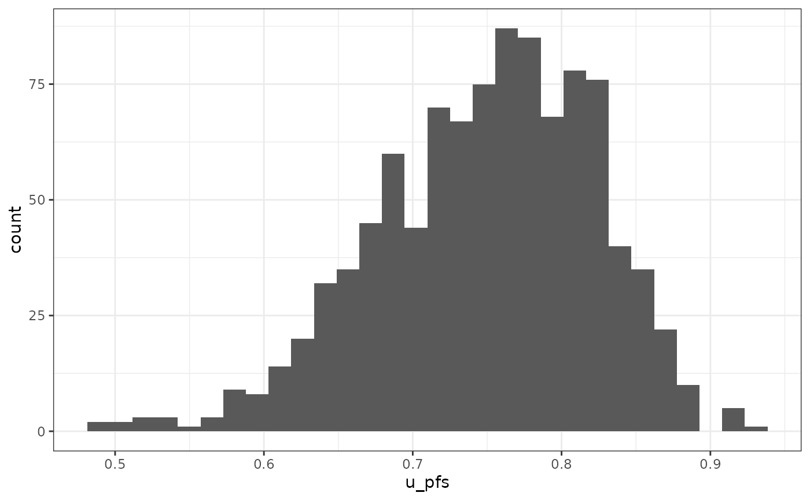

``` r
paste("Probability to be in user-defined range: ",
      check_range(df_pa,
                  param = "u_pfs",
                  min_val = 0.77,
                  max_val = 0.80
                  ), "%") # add this to plot? + lines of min/ max on plot?
```

    ## [1] "Probability to be in user-defined range:  The proportion of iterations between 0.77 and 0.8 is 15.2% %"

#### Two parameters

``` r
p_2p <- vis_2_params(df = df_pa,
                     param_1 = "u_pfs",
                     param_2 = "u_pd",
                     slope = 1,
                     check = "param_2 > param_1")
```

    ## Warning: `aes_string()` was deprecated in ggplot2 3.0.0.
    ## ℹ Please use tidy evaluation idioms with `aes()`.
    ## ℹ See also `vignette("ggplot2-in-packages")` for more information.
    ## ℹ The deprecated feature was likely used in the pacheck package.
    ##   Please report the issue at <https://github.com/Xa4P/pacheck/issues>.
    ## This warning is displayed once per session.
    ## Call `lifecycle::last_lifecycle_warnings()` to see where this warning was
    ## generated.

    ## [1] "P(TRUE): 6 %"

``` r
p_2p
```

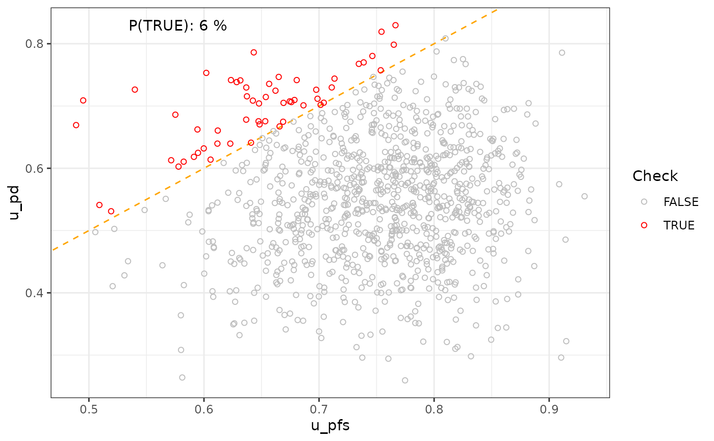

#### e. Possibility to fit user-selected distributions (beta, gamma, lognormal, normal) + visualisation + parameters of the fitted distribution.

``` r
p_2 <- vis_1_param(df = df_pa,
            param = "u_pfs",
            binwidth = NULL,
            type = "density",
            dist = c("norm", "beta", "gamma", "lnorm"),
            user_dist = "beta",
            user_param_1 = 80,
            user_param_2 = 20,
            user_mean = 0.75)
p_2
```

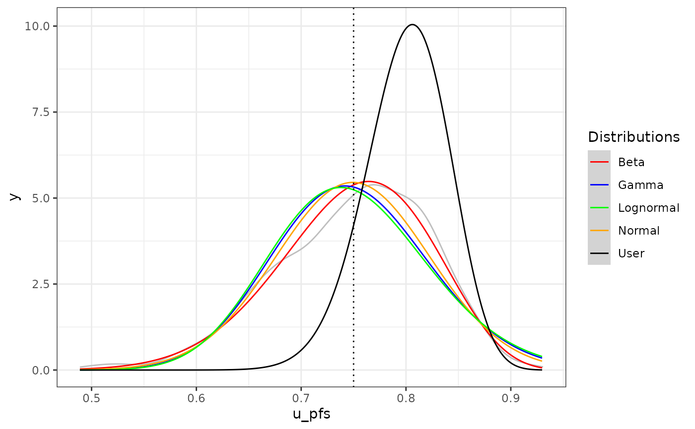

##### Distributions’ parameters & statistical fit

``` r
l_dist <- fit_dist(df = df_pa,
                   param = "u_pfs",
                   dist = c("norm", "beta", "gamma", "lnorm"))
l_dist[[1]]
```

    ##   Distribution   AIC   BIC Kolmorogov-Smirnov
    ## 1         norm -2389 -2379               0.05
    ## 2         beta -2435 -2425              0.024
    ## 3        gamma -2349 -2339              0.062
    ## 4        lnorm -2324 -2314              0.068

``` r
l_dist[[2]]
```

    ##   Distribution Name_param_1 Value_param_1 Name_param_2 Value_param_2
    ## 1         norm         mean          0.75           sd          0.07
    ## 2         beta       shape1         26.05       shape2          8.72
    ## 3        gamma        shape        100.18         rate        133.71
    ## 4        lnorm      meanlog         -0.29        sdlog           0.1

### 3. Investigate model outputs

#### a. Incremental cost-effectiveness plane & summary

``` r
p_3 <- plot_ice(
  df = df_pa,
  e_int = "t_qaly_d_int",
  e_comp = "t_qaly_d_comp",
  c_int = "t_costs_d_int",
  c_comp = "t_costs_d_comp",
  wtp = 8000
)
p_3
```

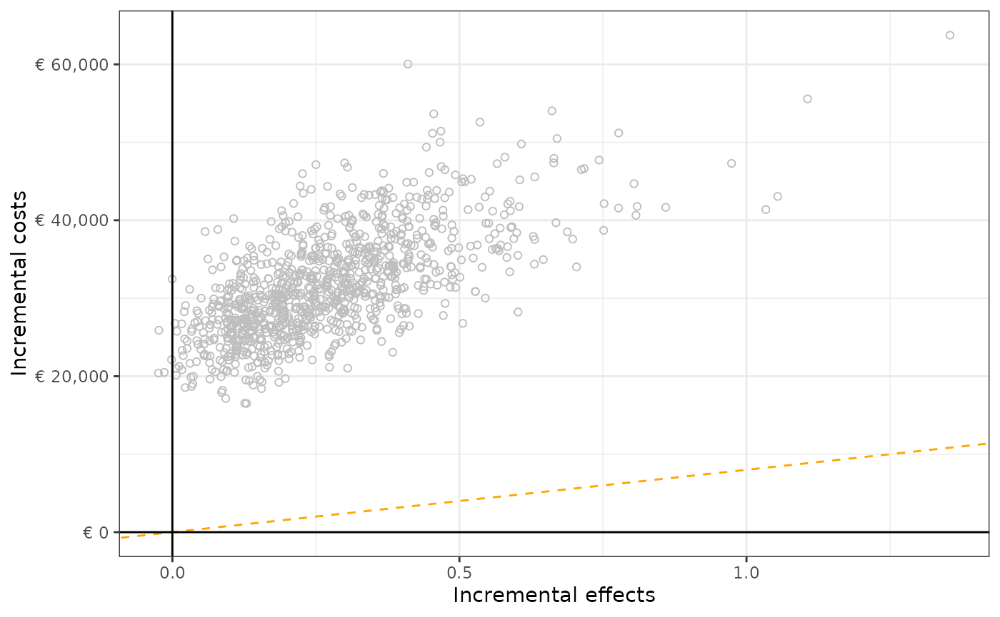

``` r
summary_ice(df_pa,
            e_int = "t_qaly_d_int",
            e_comp = "t_qaly_d_comp",
            c_int = "t_costs_d_int",
            c_comp = "t_costs_d_comp")
```

    ##                                     Quadrant Percentage
    ## 1 NorthEast (more effective, more expensive)       100%
    ## 2 SouthEast (more effective, less expensive)         0%
    ## 3 NorthWest (less effective, more expensive)         0%
    ## 4 SouthWest (less effective, less expensive)         0%

#### b. Cost-effectiveness acceptability curve.

``` r
df_ceac <- calculate_ceac(df = df_pa,
                     e_int = "t_qaly_d_int",
                     e_comp = "t_qaly_d_comp",
                     c_int = "t_costs_d_int",
                     c_comp = "t_costs_d_comp")

plot_ceac(df = df_ceac,
          name_wtp = "WTP_threshold")
```

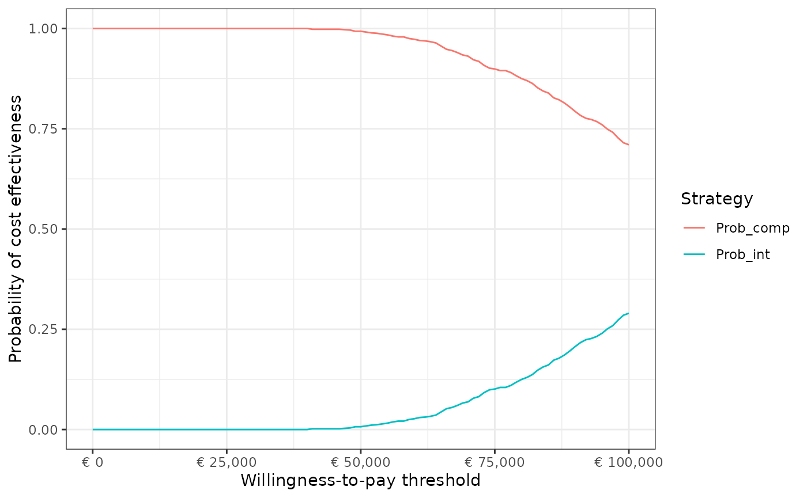

``` r
df_ceac
```

    ##     WTP_threshold Prob_int Prob_comp
    ## 1               0    0.000     1.000
    ## 2            1000    0.000     1.000
    ## 3            2000    0.000     1.000
    ## 4            3000    0.000     1.000
    ## 5            4000    0.000     1.000
    ## 6            5000    0.000     1.000
    ## 7            6000    0.000     1.000
    ## 8            7000    0.000     1.000
    ## 9            8000    0.000     1.000
    ## 10           9000    0.000     1.000
    ## 11          10000    0.000     1.000
    ## 12          11000    0.000     1.000
    ## 13          12000    0.000     1.000
    ## 14          13000    0.000     1.000
    ## 15          14000    0.000     1.000
    ## 16          15000    0.000     1.000
    ## 17          16000    0.000     1.000
    ## 18          17000    0.000     1.000
    ## 19          18000    0.000     1.000
    ## 20          19000    0.000     1.000
    ## 21          20000    0.000     1.000
    ## 22          21000    0.000     1.000
    ## 23          22000    0.000     1.000
    ## 24          23000    0.000     1.000
    ## 25          24000    0.000     1.000
    ## 26          25000    0.000     1.000
    ## 27          26000    0.000     1.000
    ## 28          27000    0.000     1.000
    ## 29          28000    0.000     1.000
    ## 30          29000    0.000     1.000
    ## 31          30000    0.000     1.000
    ## 32          31000    0.000     1.000
    ## 33          32000    0.000     1.000
    ## 34          33000    0.000     1.000
    ## 35          34000    0.000     1.000
    ## 36          35000    0.000     1.000
    ## 37          36000    0.000     1.000
    ## 38          37000    0.000     1.000
    ## 39          38000    0.000     1.000
    ## 40          39000    0.000     1.000
    ## 41          40000    0.000     1.000
    ## 42          41000    0.002     0.998
    ## 43          42000    0.002     0.998
    ## 44          43000    0.002     0.998
    ## 45          44000    0.002     0.998
    ## 46          45000    0.002     0.998
    ## 47          46000    0.002     0.998
    ## 48          47000    0.003     0.997
    ## 49          48000    0.004     0.996
    ## 50          49000    0.007     0.993
    ## 51          50000    0.007     0.993
    ## 52          51000    0.009     0.991
    ## 53          52000    0.011     0.989
    ## 54          53000    0.012     0.988
    ## 55          54000    0.014     0.986
    ## 56          55000    0.016     0.984
    ## 57          56000    0.019     0.981
    ## 58          57000    0.021     0.979
    ## 59          58000    0.021     0.979
    ## 60          59000    0.025     0.975
    ## 61          60000    0.027     0.973
    ## 62          61000    0.030     0.970
    ## 63          62000    0.031     0.969
    ## 64          63000    0.033     0.967
    ## 65          64000    0.036     0.964
    ## 66          65000    0.044     0.956
    ## 67          66000    0.052     0.948
    ## 68          67000    0.055     0.945
    ## 69          68000    0.060     0.940
    ## 70          69000    0.066     0.934
    ## 71          70000    0.069     0.931
    ## 72          71000    0.078     0.922
    ## 73          72000    0.082     0.918
    ## 74          73000    0.092     0.908
    ## 75          74000    0.099     0.901
    ## 76          75000    0.101     0.899
    ## 77          76000    0.105     0.895
    ## 78          77000    0.105     0.895
    ## 79          78000    0.110     0.890
    ## 80          79000    0.118     0.882
    ## 81          80000    0.125     0.875
    ## 82          81000    0.130     0.870
    ## 83          82000    0.137     0.863
    ## 84          83000    0.148     0.852
    ## 85          84000    0.156     0.844
    ## 86          85000    0.161     0.839
    ## 87          86000    0.173     0.827
    ## 88          87000    0.178     0.822
    ## 89          88000    0.186     0.814
    ## 90          89000    0.196     0.804
    ## 91          90000    0.207     0.793
    ## 92          91000    0.217     0.783
    ## 93          92000    0.224     0.776
    ## 94          93000    0.227     0.773
    ## 95          94000    0.232     0.768
    ## 96          95000    0.240     0.760
    ## 97          96000    0.251     0.749
    ## 98          97000    0.259     0.741
    ## 99          98000    0.273     0.727
    ## 100         99000    0.285     0.715
    ## 101        100000    0.290     0.710

#### c. Histogram and density distribution of total and incremental costs and effects.

**Can use the function above!**

#### d. Convergence graph of outcomes

``` r
plot_convergence(df = df_pa,
                 param = "iNMB"
                 )
```

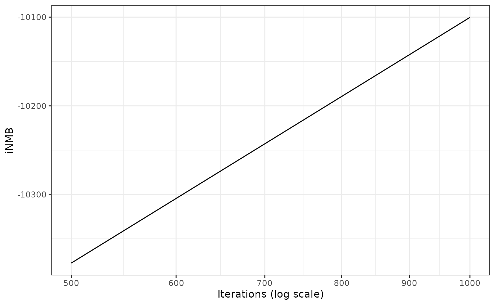

#### e. Check whether the mean quality of life outcome of each iteration remain between the maximum and minimum utility values of the specific iteration.

``` r
check_mean_qol(df = df_pa,
               t_ly = "t_ly_comp",
               t_qaly = "t_qaly_comp",
               u_values = c("u_pfs", "u_pd")
               )
```

    ##   Mean_QoL_below_min Mean_QoL_above_max
    ##   "None"             "None"

### 4. Investigate relation between inputs and outputs

#### Single

``` r
lm_rr <- fit_lm_metamodel(df = df_pa,
                          x_vars = "rr",
                          y_var = "inc_qaly")
lm_pred <- unlist(predict(lm_rr$fit, data.frame(rr = df_pa$rr)))
df_obs_pred <- data.frame(
  Values = df_pa$rr,
  Observed = df_pa$inc_qaly,
  Predicted = lm_pred
)
ggplot(data = df_obs_pred, aes(x = Values, y = Observed)) +
  geom_point(shape = 1, colour = "lightgrey") +
  geom_smooth(method = "lm") +
  theme_bw()
```

    ## `geom_smooth()` using formula = 'y ~ x'

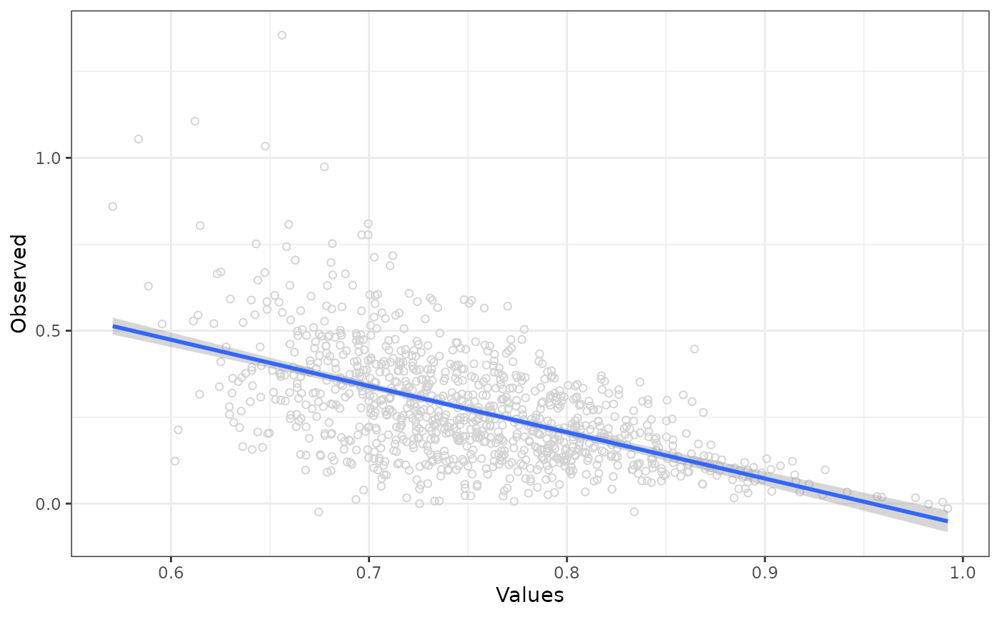

``` r
plot(lm_rr$fit)
```

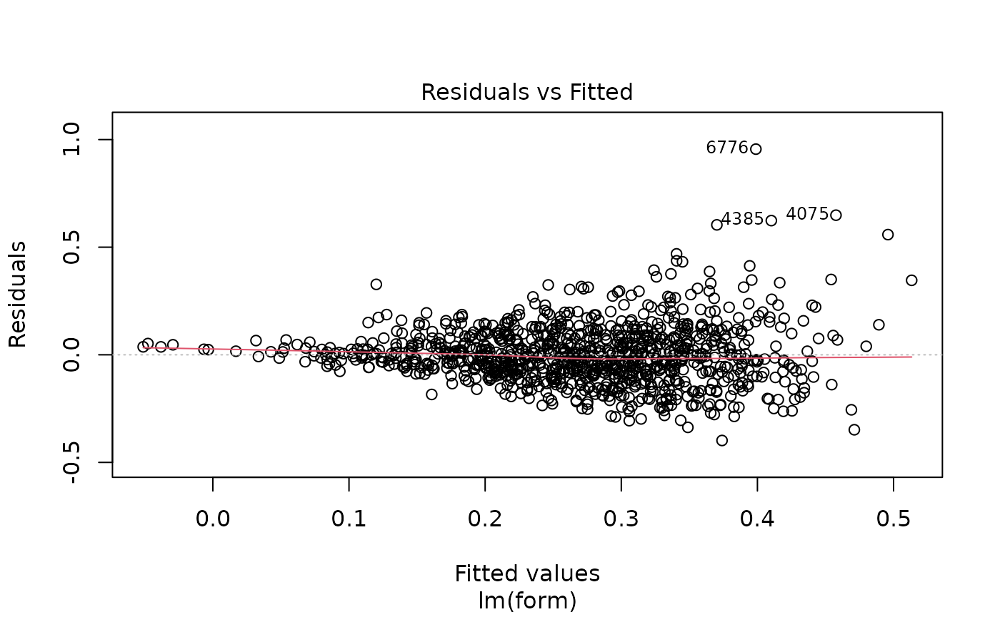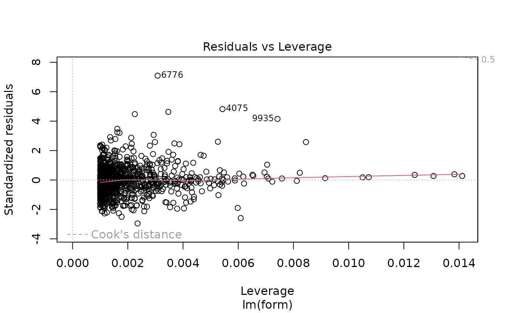

#### Multiple

``` r
lm_full <- fit_lm_metamodel(df = df_pa,
                            x_vars = c("rr",
                                       "u_pfs",
                                       "u_pd",
                                       "c_pfs",
                                       "c_pd",
                                       "c_thx",
                                       "p_pfspd",
                                       "p_pfsd",
                                       "p_pdd"),
                            y_var = "inc_qaly")
lm_pred_full <- predict(lm_full$fit, data.frame(rr = df_pa$rr,
                            u_pfs = mean(df_pa$u_pfs),
                            u_pd = mean(df_pa$u_pd),
                            c_pfs = mean(df_pa$c_pfs),
                            c_pd = mean(df_pa$c_pd),
                            c_thx = mean(df_pa$c_thx),
                            p_pfspd = mean(df_pa$p_pfspd),
                            p_pfsd = mean(df_pa$p_pfsd),
                            p_pdd = mean(df_pa$p_pdd)))

df_obs_pred_full <- data.frame(
  Values = df_pa$rr,
  Observed = df_pa$inc_qaly,
  Predicted = lm_pred_full
)

ggplot(data = df_obs_pred_full, aes(x = Values, y = Observed)) +
  geom_point(shape = 1, colour = "lightgrey") +
  geom_line(data = df_obs_pred_full, aes(x = Values, y = Predicted), colour = "blue") +
  theme_bw()
```

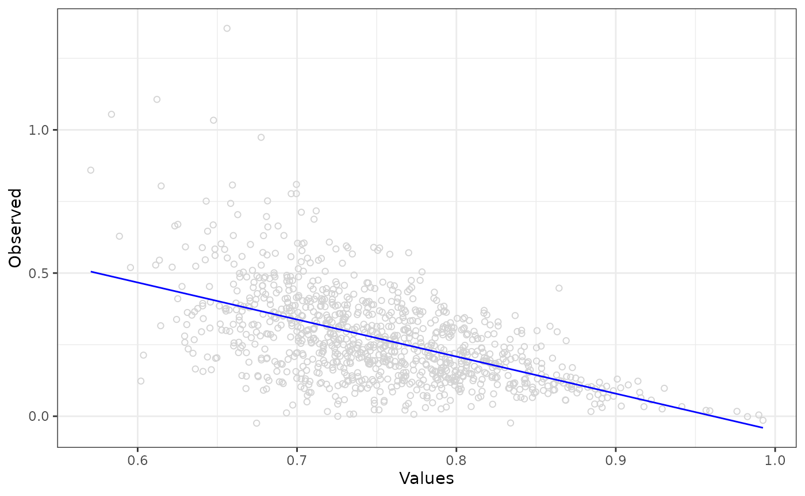

``` r
plot(lm_full$fit)
```

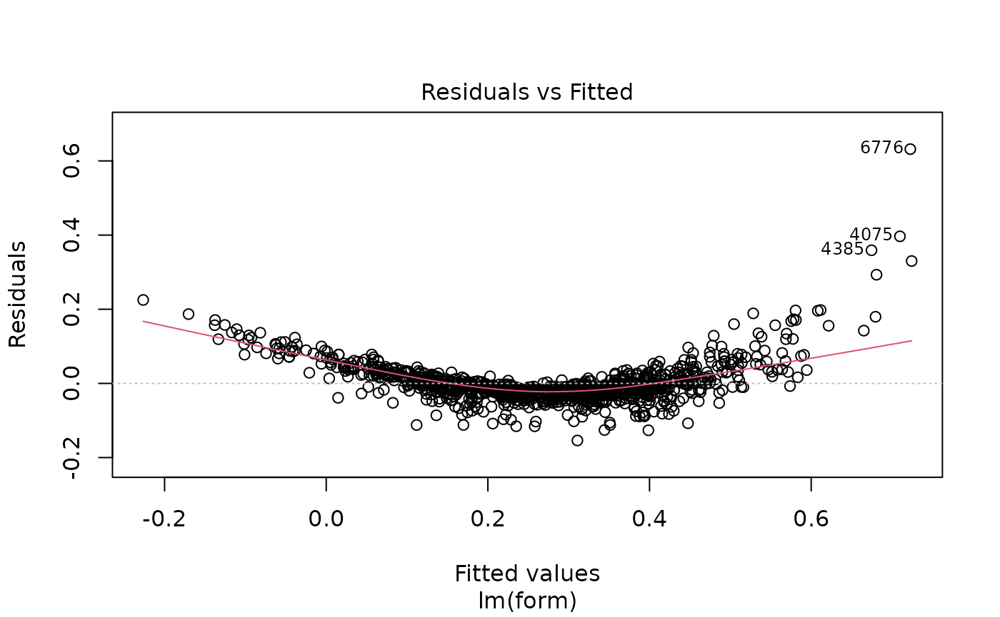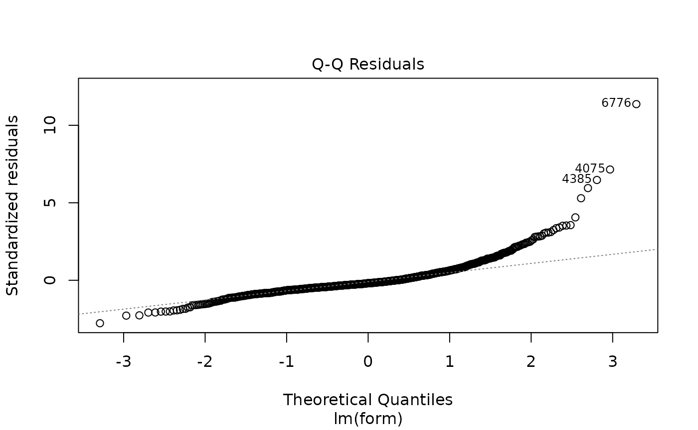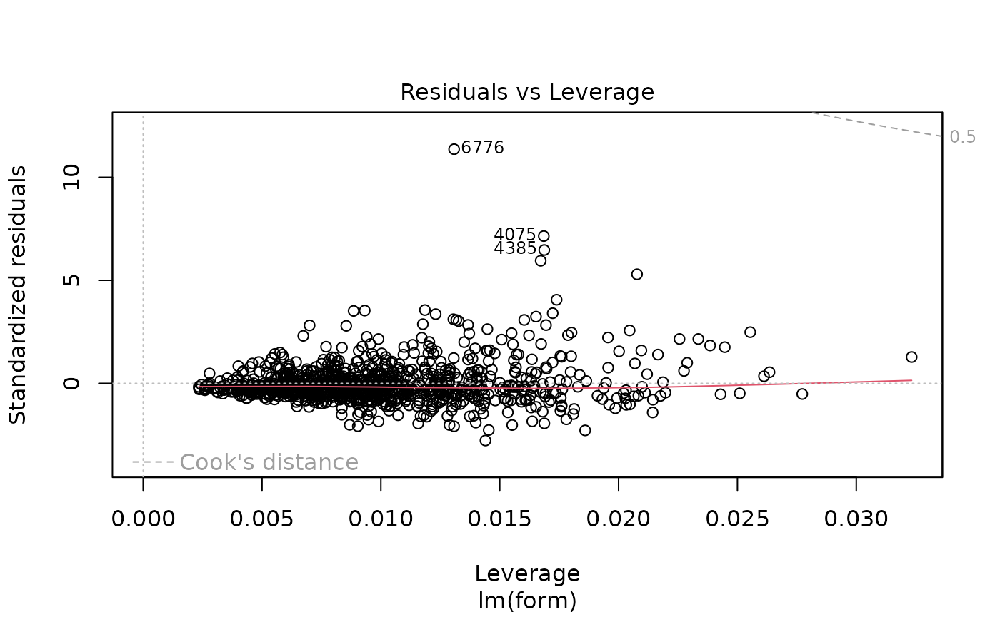

### 5. Predictions based on metamodel

``` r
# Predicting using metamodel fitted above
predict(
  lm_full$fit,
  data.frame(
    rr = 0.9,
    u_pfs = 0.75,
    u_pd = 0.4,
    c_pfs = 1000,
    c_pd = 2000,
    c_thx = 0,
    p_pfspd = 0.5,
    p_pfsd = 0.3,
    p_pdd = 0.4
  )
)
```

    ##          1 
    ## -0.4003675
