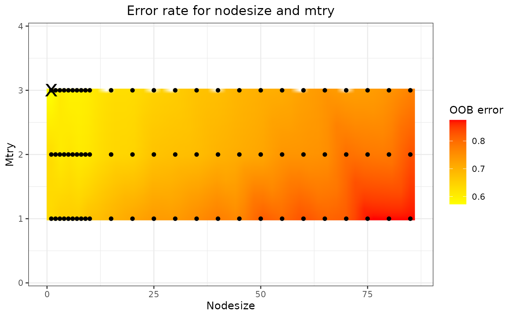
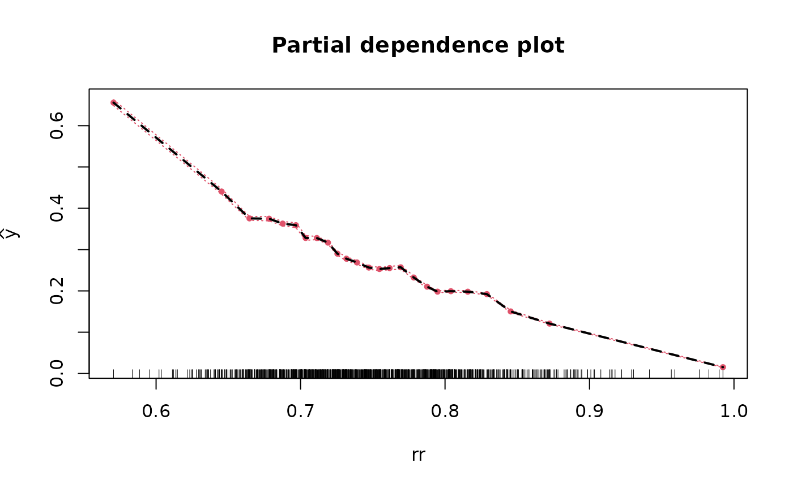
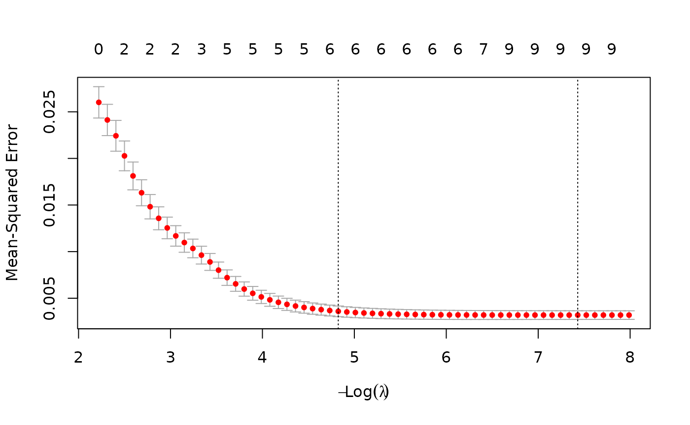
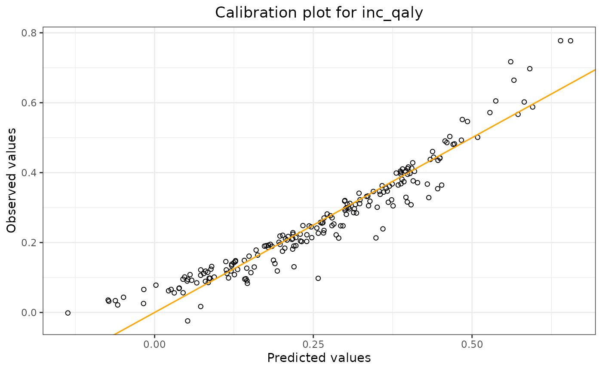

# Metamodel-Workflow

## Introduction

This article describes an example workflow for fitting and validating
metamodels, and making predictions using these metamodels, using the
`pacheck` package. The types of metamodel which the package supports
are: linear model, random forest model, and lasso model. All three
metamodels are covered. **Note**: This vignette is still in
development.  
We will use the example dataframe `df_pa` which is included in the
package.

\*\*\* Note: the functions for fitting the linear model and the random
forest model both include a ‘validation’ argument. So it is also
possible to validate the model using those functions. However, there is
also a separate function for the validation process available. \*\*\*

## Model Fitting & Parameter Information

Functions: `fit_lm_metamodel`, `fit_rf_metamodel`,
`fit_lasso_metamodel`.  
For all three models (linear model, random forest model, and lasso
model), there is a separate function used to fit the model.  
The random seed number chosen for these examples is 24.

### Linear Model

Arguments: `df`, `y_var`, `x_vars`, `seed_num`.  
We fit the linear model, and obtain the coefficients.

``` r
lm_fit <- fit_lm_metamodel(df = df_pa,
                           x_vars = c("rr",
                                       "u_pfs",
                                       "u_pd",
                                       "c_pfs",
                                       "c_pd",
                                       "c_thx",
                                       "p_pfspd",
                                       "p_pfsd",
                                       "p_pdd"),
                           y_var = "inc_qaly",
                           seed_num = 24,
                           show_intercept = TRUE)
lm_fit$fit
```

    ## 
    ## Call:
    ## lm(formula = form, data = df)
    ## 
    ## Coefficients:
    ## (Intercept)           rr        u_pfs         u_pd        c_pfs         c_pd  
    ##   1.363e+00   -1.293e+00    6.275e-01   -3.539e-01   -7.602e-06   -4.512e-06  
    ##       c_thx      p_pfspd       p_pfsd        p_pdd  
    ##  -1.349e-05   -2.850e-01   -3.632e+00    8.003e-01

#### Variable Transformation

Arguments: `standardise`, `x_poly_2`, `x_poly_3`, `x_exp`, `x_log`,
`x_inter`.  
The function also allows for the transformation of input variables.  
In the following model we standardise the regression parameters by
setting the `standardise` argument to TRUE. Standardisation is performed
as follows: $\frac{x_{j} - \overline{x_{j}}}{\sigma_{j}}$ where $x_{j}$
is the value of parameter $j$, $\overline{x_{j}}$ the mean value of
parameter $j$, and $\sigma_{j}$ its standard deviation.

``` r
lm_fit <- fit_lm_metamodel(df = df_pa,
                           x_vars = c("rr",
                                       "u_pfs",
                                       "u_pd",
                                       "c_pfs",
                                       "c_pd",
                                       "c_thx",
                                       "p_pfspd",
                                       "p_pfsd",
                                       "p_pdd"),
                           y_var = "inc_qaly",
                           seed_num = 24,
                           standardise = TRUE
                           )
lm_fit$fit
```

    ## 
    ## Call:
    ## lm(formula = form, data = df)
    ## 
    ## Coefficients:
    ## (Intercept)           rr        u_pfs         u_pd        c_pfs         c_pd  
    ##    0.270658    -0.085924     0.045913    -0.035886    -0.001470    -0.001818  
    ##       c_thx      p_pfspd       p_pfsd        p_pdd  
    ##   -0.001336    -0.010220    -0.106710     0.032889

Here we transform several variables: `rr` will be exponentiated by
factor 2, `c_pfs` & `c_pd` by factor 3, we take the exponential of
`u_pfs` & `u_pd`, and the logarithm of `p_pfsd`.

``` r
lm_fit <- fit_lm_metamodel(df = df_pa,
                           x_vars = c("p_pfspd",
                                       "p_pdd"),
                           x_poly_2 = "rr",
                           x_poly_3 = c("c_pfs","c_pd"),
                           x_exp = c("u_pfs","u_pd"),
                           x_log = "p_pfsd",
                           y_var = "inc_qaly",
                           seed_num = 24
                           )
lm_fit$fit
```

    ## 
    ## Call:
    ## lm(formula = form, data = df)
    ## 
    ## Coefficients:
    ##     (Intercept)          p_pfspd            p_pdd     poly(rr, 2)1  
    ##        -0.97789         -0.31460          0.81577         -2.70951  
    ##    poly(rr, 2)2  poly(c_pfs, 3)1  poly(c_pfs, 3)2  poly(c_pfs, 3)3  
    ##         0.41879         -0.03477         -0.07427          0.01652  
    ##  poly(c_pd, 3)1   poly(c_pd, 3)2   poly(c_pd, 3)3       exp(u_pfs)  
    ##        -0.02696          0.02767          0.03326          0.29926  
    ##       exp(u_pd)      log(p_pfsd)  
    ##        -0.19412         -0.35528

And lastly, we can also include an interaction term between `p_pfspd`
and `p_pdd`.

``` r
lm_fit <- fit_lm_metamodel(df = df_pa,
                           x_vars = c("p_pfspd",
                                       "p_pdd"),
                           x_poly_2 = "rr",
                           x_poly_3 = c("c_pfs","c_pd"),
                           x_exp = c("u_pfs","u_pd"),
                           x_log = "p_pfsd",
                           x_inter = c("p_pfspd","p_pdd"),
                           y_var = "inc_qaly",
                           seed_num = 24
                           )
lm_fit$fit
```

    ## 
    ## Call:
    ## lm(formula = form, data = df)
    ## 
    ## Coefficients:
    ##     (Intercept)          p_pfspd            p_pdd     poly(rr, 2)1  
    ##        -0.93155         -0.61761          0.59049         -2.70483  
    ##    poly(rr, 2)2  poly(c_pfs, 3)1  poly(c_pfs, 3)2  poly(c_pfs, 3)3  
    ##         0.41959         -0.03496         -0.07264          0.01523  
    ##  poly(c_pd, 3)1   poly(c_pd, 3)2   poly(c_pd, 3)3       exp(u_pfs)  
    ##        -0.02689          0.02731          0.03460          0.29812  
    ##       exp(u_pd)      log(p_pfsd)    p_pfspd:p_pdd  
    ##        -0.19352         -0.35546          1.50843

### Random Forest Model

The random forest metamodel are fitted using the
[randomForestSRC](https://cran.r-project.org/package=randomForestSRC) R
package. Arguments: `df`, `y_var`, `x_vars`, `seed_num`.

**Note that for the RF model several variables are omitted to reduce
computation time**

``` r
rf_fit <- fit_rf_metamodel(df = df_pa,
                           x_vars = c("rr",
                                       "u_pfs",
                                       "u_pd"),
                                       #"c_pfs",
                                       #"c_pd",
                                       #"c_thx",
                                       #"p_pfspd",
                                       #"p_pfsd",
                                       #"p_pdd"),
                           y_var = "inc_qaly",
                           seed_num = 24)
```

#### Variable importance

Setting the `var_importance` argument to TRUE returns a plot which shows
the importance of the included x-variables. The larger the number is,
the more important the variable is, meaning that it greatly reduces the
out-of-bag (OOB) error rate compared to the other x-variables.

``` r
rf_fit <- fit_rf_metamodel(df = df_pa,
                           x_vars = c("rr",
                                       "u_pfs",
                                       "u_pd"),
                                       #"c_pfs",
                                       #"c_pd",
                                       #"c_thx",
                                       #"p_pfspd",
                                       #"p_pfsd",
                                       #"p_pdd"),
                           y_var = "inc_qaly",
                           var_importance = TRUE,
                           seed_num = 24)
```


#### Tuning nodesize and mtry

By using the `tune` argument , two parameters which can have a
significant impact on the model fit are `nodesize` (the minimal size of
the terminal node) and `mtry` (the number of variables to possibly split
at each node) are optimised to improve model fit. The tuning process
consists of a grid search. If `tune = FALSE`, default values for
`nodesize` and `mtry` are used, which are 5 and (nr of x-variables)/3,
respectively.

``` r
rf_fit <- fit_rf_metamodel(df = df_pa,
                           x_vars = c("rr",
                                       "u_pfs",
                                       "u_pd"),
                                       #"c_pfs",
                                       #"c_pd",
                                       #"c_thx",
                                       #"p_pfspd",
                                       #"p_pfsd",
                                       #"p_pdd"),
                           y_var = "inc_qaly",
                           var_importance = FALSE,
                           tune = TRUE,
                           seed_num = 24)
rf_fit$tune_fit$optimal
```

    ## nodesize     mtry 
    ##        1        3

``` r
rf_fit$tune_plot
```



The optimal `nodesize` and `mtry` can be found in the
`rf_fit$tune_fit$optimal` element of the list, and the results are shown
in the plot (in this case `rf_fit$tune_plot`). On this plot, the black
dots represent the combinations of `nodesize` and `mtry` that have been
tried, the colour gradient is obtained through 2-dimensional
interpolation. The black cross marks the optimal combination, i.e., the
combination yielding the lowest OOB error.

#### Partial & marginal plots

We can obtain partial and marginal plots, by setting `pm_plot` equal to
‘partial’, ‘marginal’, or ‘both’. `pm_vars` specifies for which
variables the plot must be constructed.

``` r
rf_fit <- fit_rf_metamodel(df = df_pa,
                           x_vars = c("rr",
                                       "u_pfs",
                                       "u_pd"),
                                       #"c_pfs",
                                       #"c_pd",
                                       #"c_thx",
                                       #"p_pfspd",
                                       #"p_pfsd",
                                       #"p_pdd"),
                           y_var = "inc_qaly",
                           var_importance = FALSE,
                           tune = TRUE,
                           pm_plot = "both",
                           pm_vars = c("rr","u_pfs"),
                           seed_num = 24)
```



### Lasso Model

We fit the lasso model and obtain the coefficients using all parameter
values from all iterations.

``` r
lasso_fit <- fit_lasso_metamodel(df = df_pa,
                                 x_vars = c("rr",
                                             "u_pfs",
                                             "u_pd",
                                             "c_pfs",
                                             "c_pd",
                                             "c_thx",
                                             "p_pfspd",
                                             "p_pfsd",
                                             "p_pdd"),
                                 y_var = "inc_qaly",
                                 tune_plot = TRUE,
                                 seed_num = 24)
```



``` r
lm_fit$fit
```

    ## 
    ## Call:
    ## lm(formula = form, data = df)
    ## 
    ## Coefficients:
    ##     (Intercept)          p_pfspd            p_pdd     poly(rr, 2)1  
    ##        -0.93155         -0.61761          0.59049         -2.70483  
    ##    poly(rr, 2)2  poly(c_pfs, 3)1  poly(c_pfs, 3)2  poly(c_pfs, 3)3  
    ##         0.41959         -0.03496         -0.07264          0.01523  
    ##  poly(c_pd, 3)1   poly(c_pd, 3)2   poly(c_pd, 3)3       exp(u_pfs)  
    ##        -0.02689          0.02731          0.03460          0.29812  
    ##       exp(u_pd)      log(p_pfsd)    p_pfspd:p_pdd  
    ##        -0.19352         -0.35546          1.50843

The plot shows the tuning results: the error rate for each lambda. The
smallest lambda is chosen for the full model.

Generally, the lasso procedure yields sparse models, i.e., models that
involve only a subset of the set of input variables. In this case
however, no coefficients are set to 0, and we have the same results as
we obtained from the linear model.

## Model Validation

Validating the metamodels can be performed using the `validation`
arguments of the metamodel functions, or by using the
`validate_metamodel` function.

Through the `validate_metamodel` function, three types of validation
methods can be used: the train/test split, (K-fold) cross-validation,
and using a new dataset. We will discuss each validation method.

### Train/test split and Linear Model

Arguments: `method`, `partition`.

First we use the train/test split. For this we need to specify
`partition`, which sets the proportion of the data that will be used for
the training data. We also set `show_intercept` to `TRUE` for the
calibration plot.

``` r
lm_validation = validate_metamodel(lm_fit,
                                   method = "train_test_split",
                                   partition = 0.8,
                                   show_intercept = TRUE,
                                   seed_num = 24)
lm_validation$stats_validation
```

    ##            Statistics Value (method: train/test split)
    ## 1           R-squared                            0.914
    ## 2 Mean absolute error                            0.032
    ## 3 Mean relative error                            0.758
    ## 4  Mean squared error                            0.002

``` r
lm_validation$calibration_plot
```



The output shows the validation results: R-squared, mean absolute error,
mean relative error, and the mean squared error of the model applied to
the test data. By using `lm_validation$calibration_plot`, we can display
the calibration plot.

### K-fold Cross-Validation and Random Forest Model

Arguments: `method`, `folds`.

To use k-fold cross-validation, one needs to specify
`method = "cross_validation"`. In the example, two folds are used by
specifying `fold = 2`.

``` r
rf_validation = validate_metamodel(rf_fit,
                                   method = "cross_validation",
                                   folds = 2,
                                   seed_num = 24)
rf_validation$stats_validation
```

    ##             Statistic Value (method: cross-validation)
    ## 1           R-squared                            0.343
    ## 2 Mean absolute error                            0.098
    ## 3 Mean relative error                            2.272
    ## 4  Mean squared error                            0.017

### New Dataset and Lasso Model

Arguments: `method`, `df_validate`.

It also might happen that a validation dataset is obtained once the
model has already been fitted some time ago. The function enables us to
use this dataset for the validation process.

Since we only have one dataset, we first construct two datasets, where
one dataset is used to fit the model, and the other is used to validate
the model. Note that doing it like this, it is very similar to the
train/test split method.

``` r
indices = sample(8000)
df_original = df_pa[indices,]
df_new = df_pa[-indices,]

lasso_fit2 <- fit_lasso_metamodel(df = df_original,
                                 x_vars = c("rr",
                                             "u_pfs",
                                             "u_pd",
                                             "c_pfs",
                                             "c_pd",
                                             "c_thx",
                                             "p_pfspd",
                                             "p_pfsd",
                                             "p_pdd"),
                                 y_var = "inc_qaly",
                                 tune_plot = FALSE,
                                 seed_num = 24)

lasso_validation <- validate_metamodel(lasso_fit2,
                                   method = "new_test_set",
                                   df_validate = df_new,
                                   seed_num = 24)
rf_validation$stats_validation
```

    ##             Statistic Value (method: cross-validation)
    ## 1           R-squared                            0.343
    ## 2 Mean absolute error                            0.098
    ## 3 Mean relative error                            2.272
    ## 4  Mean squared error                            0.017

## Making Predictions

Function: `predict_metamodel`. Arguments: `inputs`, `output_type`

There is one function which can be used to make predictions using the
fitted metamodels: `predict_metamodel`.

As an example, we will fit a four-variable model for all three metamodel
types and with the following inputs:

| p_pfspd | p_pfsd | p_pdd |   rr |
|--------:|-------:|------:|-----:|
|     0.1 |   0.08 |  0.06 | 0.10 |
|     0.2 |   0.15 |  0.25 | 0.23 |

Example inputs for metamodels

Thus we will obtain two predictions.

There are two ways to enter the inputs for the metamodel: as a vector or
as a dataframe. The same holds for the output of the function: a vector
or a dataframe. We will cover all four scenarios.

First we fit the models and define the inputs. Note that we do not
validate the model first (which is not according to best practices) and
use all available data to fit the models.

``` r
#fit the models
lm_fit2 = fit_lm_metamodel(df = df_pa,
                           x_vars = c("p_pfspd",
                                       "p_pfsd",
                                       "p_pdd",
                                      "rr"),
                           y_var = "inc_qaly",
                           seed_num = 24)

rf_fit2 = fit_rf_metamodel(df = df_pa,
                           x_vars = c("p_pfspd",
                                       "p_pfsd",
                                       "p_pdd",
                                      "rr"),
                           y_var = "inc_qaly",
                           tune = TRUE,
                           seed_num = 24
                           )

lasso_fit3 <- fit_lasso_metamodel(df = df_pa,
                                 x_vars = c("p_pfspd",
                                       "p_pfsd",
                                       "p_pdd",
                                      "rr"),
                                 y_var = "inc_qaly",
                                 tune_plot = FALSE,
                                 seed_num = 24)
#define the inputs
ins_vec = c(0.1,0.2,0.08,0.15,0.06,0.25,0.1,0.23) #vector

ins_df = newdata #dataframe (defined above)
```

Note that the order of the input vector matters. If we have a
four-variable model, and we want to make two predictions, the first two
values are for the first variable, the next two values are for the
second variable, etc. ‘First’ and ‘second’ refer to the placement of the
variable in the model as defined in the R-code. So in our example, the
first and second variable is `p_pfspd` and `p_pfsd`, respectively.

### 1. Input: vector (Linear Model)

``` r
predictions = predict_metamodel(lm_fit2,
                                inputs = ins_vec,
                                output_type = "vector")

print(predictions)
```

    ## [1] 1.0566582 0.7533956

### 2. Input: dataframe (Lasso Model)

``` r
predictions = predict_metamodel(lasso_fit3,
                                inputs = ins_df,
                                output_type = "vector")

print(predictions)
```

    ## [1] 1.0528023 0.7510356

### 3. Output: vector (Random Forest Model)

``` r
predictions = predict_metamodel(rf_fit2,
                                inputs = ins_vec,
                                output_type = "vector")

print(predictions)
```

    ## [1] 0.5019730 0.1920559

### 4. Output: dataframe (Linear Model)

``` r
predictions = predict_metamodel(lm_fit2,
                                inputs = ins_vec,
                                output_type = "dataframe")

print(predictions)
```

    ##   p_pfspd p_pfsd p_pdd   rr predictions
    ## 1     0.1   0.08  0.06 0.10   1.0566582
    ## 2     0.2   0.15  0.25 0.23   0.7533956
