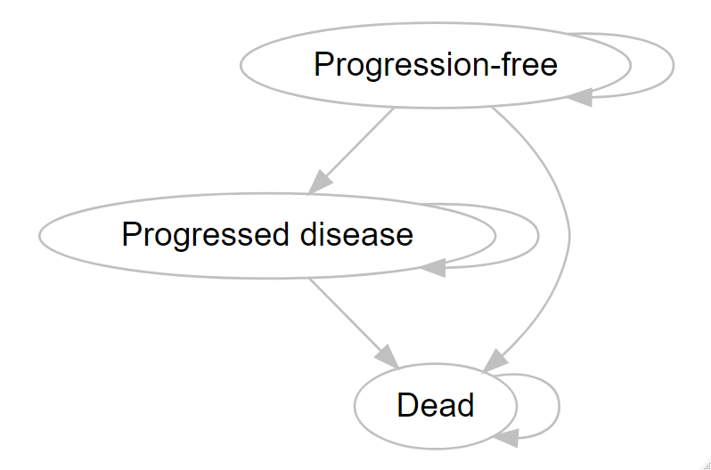

```{r setup, include = FALSE}
# library(DiagrammeR)
# library(DiagrammeRsvg)
# library(rsvg)
devtools::load_all()
knitr::opts_chunk$set(echo = FALSE)
```

# Description
This Appendix describes the probabilistic model inputs and outputs of the mock health economic (HE) models developed to tests the functionalities of the Probabilistic Analysis Check dashBOARD (PACBOARD). The HE models and functions are available at https://github.com/Xa4P/pacheck. The inputs and outputs value are stored within the `df_pa` and `df_pa_psm` objects of the `pacheck` package. The `df_pa` and `df_pa_psm` objects were obtained by running the `01-data_preparation.R` R script. The `df_pa` object contains the probabilistic inputs and outputs obtained with a health state transition model (HSTM) and the `df_pa_psm` object contains the probabilistic inputs and outputs obtained with a partitioned survival model (PSM).   

# Model description  
Both HE model compares two strategies, called "intervention" and "comparator" for the treatment of mestatatic breast cancer. We used a yearly cycle and a time horizon of 30 years. We did not apply half cycle correction.  
The "intervention" strategy incurs treatment costs and reduces the transition probability from PFS to PD compared to the "comparator" strategy in the HSTM and it reduces the probability of progression and death in the PSM. In addition, there is a chance of experiencing adverse events in the intervention strategy which incurs additional costs and utility decrement once at the beginning of both HE models. The "comparator" strategy entails "doing nothing" and does not incur any treatment costs and adverse event-related utility decrement and costs.  

## Model structure & assumptions
A cohort-based HSTM and PSM with three health states were developed. The health states were: "Progression-free" (PF), "Progressed disease" (PD), and "Dead" (D). All individuals of the cohort start in the PF health state and can progress to the PD health state or to the D health state. Once individuals are in the PD health state, they cannot transit back to the PF health state but they can transit to the D health state. The D health state is the absorbing health state. The model structure is provided below.  

```{r mod_structure, include = FALSE}
# diagram <- "
# digraph {
# 
#   # graph attributes
#   graph [overlap = true]
#   
#   # nodes attributes
#   node [fontname = Helvetica,
#   color = gray]
#   A[label = 'Progression-free']
#   B[label = 'Progressed disease']
#   C[label = Dead]
#   
#   # edge attributes
#   edge [color = gray]
#   
#   A -> A
#   A -> B
#   A -> C
#   
#   B -> B
#   B -> C
#   
#   C -> C
# }
# "
# grViz(diagram)
```

```{r mod_structure_import, fig.align = 'center', out.width = "70%", echo = FALSE}

```

# Model inputs
The probabilistic model inputs were estimated based on the below-described distribution and parameter estimates, using the `generate_pa_inputs()` and `generate_pa_inputs_psm()` functions of the `pacheck` package.  

| Parameter name | Description | Mean value | Standard Error (or 95%CI) | Distribution |
|:---------------|:------------|:-----------|:--------------------------|:-------------|
| `p_pfspd` | Probability of transiting from PF to PD | 0.15 |`r round(sd(df_pa$p_pfspd), 2)`*| Dirichlet |
| `p_pfsd` | Probability of transiting from PF to D | 0.1 |`r round(sd(df_pa$p_pfsd), 2)`*| Dirichlet |
| `p_pdd` | Probability of transiting from PD to D | 0.2 | 0.04 | Beta |
| `p_ae` | Probability of experiencing an adverse event (intervention only) | 0.05 | 0.02 | Beta |
| `rr` | Relative risk of progression (PF to PD) of the intervention versus the comparator| 0.75 | 0.62-0.88 | Lognormal |
| `u_pfs` | Utility value of health state PF | 0.75 | 0.07 | Beta |
| `u_pd` | Utility value of health state PD | 0.55 | 0.1 | Beta |
| `u_ae` | Utility decrement when experiencing an adverse event | 0.15 | 0.05 | Beta |
| `c_pfs` | Annual costs of health state PF | 1000 | 200 | Normal |
| `c_pd` | Annual costs of health state PD | 2000 | 400 | Normal |
| `c_thx`| Annual costs treatment (intervention) | 10000 | 100 | Normal | 
| `c_ae` | Costs of treating an adverse event | 500 | 100 | Gamma |
| `r_d_effects` | Annual discount rate effects | 0.015 | - | Fixed |
| `r_d_costs` | Annual discount rate costs | 0.04 | - | Fixed |
  : Overview of the HSTM input values  
  
*Calculated based on the output of the Dirichlet distribution  


| Parameter name | Description | Mean value | Standard Error (or 95%CI) | Distribution |
|:---------------|:------------|:-----------|:--------------------------|:-------------|
| `r_exp_pfs_comp` | Rate exponential progression-free survival curve of the comparator strategy | `r round(mean(df_pa_psm$r_exp_pfs_comp), 2)`* |`r round(sd(df_pa_psm$r_exp_pfs_comp), 2)`*| Bootstrap synthetic data |
| `rr_thx_pfs` | Effectiveness of the intervention on the rate of progression of the comparator | `r round(mean(df_pa_psm$r_exp_pfs_int), 2)`* |`r round(sd(df_pa_psm$r_exp_pfs_int), 2)`*| Bootstrap synthetic data |
| `r_exp_pfs_int` | Rate exponential progression-free survival curve of the intervention strategy | `r round(mean(df_pa_psm$r_exp_pfs_int), 2)`* |`r round(sd(df_pa_psm$r_exp_pfs_int), 2)`* | Calculation:  `r_exp_pfs_comp` * `rr_thx_pfs`|
| `shape_weib_os` | Shape of the Weibull overall survival curve (same shape for both strategies)| `r round(mean(df_pa_psm$shape_weib_os), 2)`* |`r round(sd(df_pa_psm$shape_weib_os), 2)`*| Bootstrap synthetic data |
| `scale_weib_os_comp` | Scale of the Weibull overall survival curve of the comparator strategy| `r round(mean(df_pa_psm$scale_weib_os_comp), 2)`* |`r round(sd(df_pa_psm$scale_weib_os_comp), 2)`*| Bootstrap synthetic data |
| `rr_thx_os` | Effectiveness of the intervention on the scale of the Weibull overall survival curve of the comparator strategy | `r round(mean(df_pa_psm$rr_thx_os), 2)`* |`r round(sd(df_pa_psm$rr_thx_os), 2)`* | Bootstrap synthetic data |
| `scale_weib_os_int` | Scale of the Weibull overall survival curve of the intervention strategy| `r round(mean(df_pa_psm$scale_weib_os_int), 2)`* |`r round(sd(df_pa_psm$scale_weib_os_int), 2)`* | Calculation: `scale_weib_os_comp` * `rr_thx_os`|
| `p_ae` | Probability of experiencing an adverse event (intervention only) | 0.05 | 0.02 | Beta |
| `u_pfs` | Utility value of health state PF | 0.75 | 0.07 | Beta |
| `u_pd` | Utility value of health state PD | 0.55 | 0.1 | Beta |
| `u_ae` | Utility decrement when experiencing an adverse event | 0.15 | 0.05 | Beta |
| `c_pfs` | Annual costs of health state PF | 1000 | 200 | Normal |
| `c_pd` | Annual costs of health state PD | 2000 | 400 | Normal |
| `c_thx`| Annual costs treatment (intervention) | 10000 | 100 | Normal | 
| `c_ae` | Costs of treating an adverse event | 500 | 100 | Gamma |
| `r_d_effects` | Annual discount rate effects | 0.015 | - | Fixed |
| `r_d_costs` | Annual discount rate costs | 0.04 | - | Fixed |
  : Overview of the PSM input values  

*Calculated based on the output of the bootstrapping  

# Analysis
A probabilistic analysis of 10,000 iterations was performed through Monte Carlo analysis using both HE models. Model inputs and intermediate and final output values for each iteration were recorded. The recorded outputs were:  
- `t_ly_int` & `t_ly_comp`: total undiscounted life years for each strategy  
- `t_ly_d_int` & `t_ly_d_comp`: total discounted life years for each strategy  
- `t_qaly_int` & `t_qaly_comp`: total undiscounted quality-adjusted life years for each strategy  
- `t_qaly_d_int` & `t_qaly_d_comp`: total discounted quality-adjusted life years for each strategy  
- `t_costs_int` & `t_costs_comp`: total undiscounted costs for each strategy  
- `t_costs_d_int` & `t_costs_d_comp`: total discounted costs for each strategy  
- `t_ly_pfs_d_int`, `t_ly_pd_d_int`, `t_ly_pfs_d_comp` & `t_ly_pd_d_comp`: discounted life years per health state for each strategy  
- `t_qaly_pfs_d_int`, `t_qaly_pd_d_int`, `t_qaly_pfs_d_comp` & `t_qaly_pd_d_comp`: discounted quality-adjusted life years per health state for each strategy  
- `t_costs_pfs_d_int`, `t_costs_pd_d_int`, `t_costs_pfs_d_comp` & `t_costs_pd_d_comp`: discounted costs per health state for each strategy  
- `t_qaly_ae_int`: total QALY decrement associated with the occurrence of adverse events  
- `t_costs_ae_int`: total costs associated with the occurrence of adverse events  
- `inc_ly`: incremental discounted life years of the intervention versus the comparator   
- `inc_qaly`: incremental discounted quality-adjusted life years of the intervention versus the comparator   
- `inc_costs`: incremental discounted costs of the intervention versus the comparator   
The probabilistic analysis is performed using a for loop and the function `perform_simulation()`.  
 
# Results HSTM
The intervention results in `r round(mean(df_pa$inc_ly), 2)` incremental life years, `r round(mean(df_pa$inc_qaly), 2)` incremental quality-adjusted life years, and `r paste("\u20ac", format(round(mean(df_pa$inc_costs), 0), scientific = FALSE, big.mark = ","))` incremental costs versus the comparator. The incremental cost effectiveness ratio of the intervention versus the comparator is `r paste("\u20ac", format(round(mean(df_pa$inc_costs) / mean(df_pa$inc_qaly), 0), scientific = FALSE, big.mark = ","))` per QALY.  
The probabilistic results of this HE model are provided in the table below and are plotted in an incremental cost-effectiveness plane (displaying a willingness to pay threshold line of `r paste("\u20ac")`80,000 per QALY) and a cost-effectiveness acceptability curve.  

| Strategy     | Total LY | Total QALY | Total costs | Inc. QALY | Inc. costs | ICER per QALY |
|:-------------|:---------|:-----------|:------------|:----------|:-----------|:--------------|
| Comparator   |`r round(mean(df_pa$t_ly_d_comp), 2)`|`r round(mean(df_pa$t_qaly_d_comp), 2)`|`r paste("\u20ac", format(round(mean(df_pa$t_costs_d_comp), 0), scientific = FALSE, big.mark = ","))`| - | - | - |
| Intervention |`r round(mean(df_pa$t_ly_d_int), 2)`|`r round(mean(df_pa$t_qaly_d_int), 2)`|`r paste("\u20ac", format(round(mean(df_pa$t_costs_d_int), 0), scientific = FALSE, big.mark = ","))`|`r round(mean(df_pa$inc_qaly), 2)`|`r paste("\u20ac", format(round(mean(df_pa$inc_costs), 0), scientific = FALSE, big.mark = ","))`|`r paste("\u20ac", format(round(mean(df_pa$inc_costs) / mean(df_pa$inc_qaly), 0), scientific = FALSE, big.mark = ","))`|
  : Overview of the results of the HE model  

Abbreviations: ICER = incremental cost-effectiveness ratio; Inc. = incremental; LY = life years; QALY = quality-adjusted life years  

\newpage
```{r ice_plot}
plot_ice(df = df_pa,
         e_int = "t_qaly_d_int",
         e_comp = "t_qaly_d_comp",
         c_int = "t_costs_d_int",
         c_comp = "t_costs_d_comp",
         wtp = 80000) +
  ggtitle("Incremental cost-effectiveness plane")
```

```{r ceac, message = FALSE}
v_wtp <- seq(from = 0, to = 150000, by = 1000)
m_res_ceac <- calculate_ceac(df_pa,
                             e_int = "t_qaly_int",
                             e_comp = "t_qaly_comp",
                             c_int = "t_costs_int",
                             c_comp = "t_costs_comp",
                             v_wtp = v_wtp)
df_ceac_p <- as.data.frame(m_res_ceac)

plot_ceac(df = df_ceac_p,
          wtp = "WTP_threshold") +
  ggtitle("Cost-effectiveness acceptability curves")
```

# Results PSM
The intervention results in `r round(mean(df_pa_psm$inc_ly), 2)` incremental life years, `r round(mean(df_pa_psm$inc_qaly), 2)` incremental quality-adjusted life years, and `r paste("\u20ac", format(round(mean(df_pa_psm$inc_costs), 0), scientific = FALSE, big.mark = ","))` incremental costs versus the comparator. The incremental cost effectiveness ratio of the intervention versus the comparator is `r paste("\u20ac", format(round(mean(df_pa_psm$inc_costs) / mean(df_pa_psm$inc_qaly), 0), scientific = FALSE, big.mark = ","))` per QALY.  
The probabilistic results of this HE model are provided in the table below and are plotted in an incremental cost-effectiveness plane (displaying a willingness to pay threshold line of `r paste("\u20ac")`80,000 per QALY) and a cost-effectiveness acceptability curve.  

| Strategy     | Total LY | Total QALY | Total costs | Inc. QALY | Inc. costs | ICER per QALY |
|:-------------|:---------|:-----------|:------------|:----------|:-----------|:--------------|
| Comparator   |`r round(mean(df_pa_psm$t_ly_d_comp), 2)`|`r round(mean(df_pa_psm$t_qaly_d_comp), 2)`|`r paste("\u20ac", format(round(mean(df_pa_psm$t_costs_d_comp), 0), scientific = FALSE, big.mark = ","))`| - | - | - |
| Intervention |`r round(mean(df_pa_psm$t_ly_d_int), 2)`|`r round(mean(df_pa_psm$t_qaly_d_int), 2)`|`r paste("\u20ac", format(round(mean(df_pa_psm$t_costs_d_int), 0), scientific = FALSE, big.mark = ","))`|`r round(mean(df_pa_psm$inc_qaly), 2)`|`r paste("\u20ac", format(round(mean(df_pa_psm$inc_costs), 0), scientific = FALSE, big.mark = ","))`|`r paste("\u20ac", format(round(mean(df_pa_psm$inc_costs) / mean(df_pa_psm$inc_qaly), 0), scientific = FALSE, big.mark = ","))`|
  : Overview of the results of the HE model  

Abbreviations: ICER = incremental cost-effectiveness ratio; Inc. = incremental; LY = life years; QALY = quality-adjusted life years  

\newpage
```{r ice_plot_psm}
plot_ice(df = df_pa_psm,
         e_int = "t_qaly_d_int",
         e_comp = "t_qaly_d_comp",
         c_int = "t_costs_d_int",
         c_comp = "t_costs_d_comp",
         wtp = 80000) +
  ggtitle("Incremental cost-effectiveness plane")
```

```{r ceac_psm, message = FALSE}
v_wtp <- seq(from = 0, to = 150000, by = 1000)
m_res_ceac <- calculate_ceac(df_pa_psm,
                             e_int = "t_qaly_int",
                             e_comp = "t_qaly_comp",
                             c_int = "t_costs_int",
                             c_comp = "t_costs_comp",
                             v_wtp = v_wtp)
df_ceac_p <- as.data.frame(m_res_ceac)

plot_ceac(df = df_ceac_p,
          wtp = "WTP_threshold") +
  ggtitle("Cost-effectiveness acceptability curves")
```
